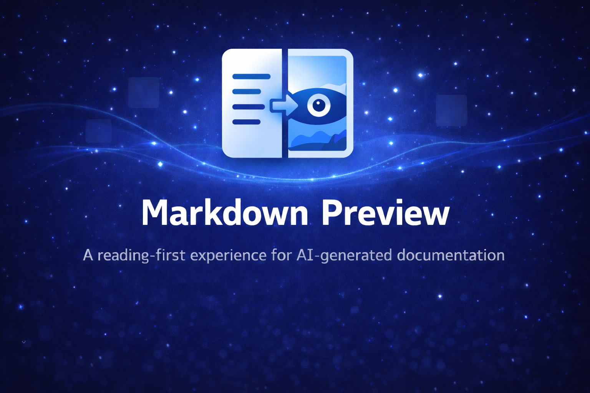

# Markdown Preview

<p align="center">
  
</p>

<p align="center">
  <a href="https://github.com/ayhammouda/markdown-preview/actions/workflows/ci.yml">
    
  </a>
  <a href="https://github.com/ayhammouda/markdown-preview/releases">
    
  </a>
  <a href="LICENSE">
    
  </a>
</p>

<p align="center">
  Open markdown files in preview mode by default with a focused, reading-first workflow.
</p>

<!-- Marketplace badges will go here once published -->

---

## Status

Preview-by-default, edit mode, and formatting toolbar actions are available for a focused read/write loop.

## Table of Contents

- [Features](#star-features)
- [Requirements](#clipboard-requirements)
- [Quick Start](#zap-quick-start)
- [Commands](#keyboard-commands)
- [Keyboard Shortcuts](#zap-keyboard-shortcuts)
- [Settings](#gear-settings)
- [Known Limitations](#warning-known-limitations)
- [How It Works](#bulb-how-it-works)
- [Privacy](#lock-privacy)
- [Troubleshooting](#wrench-troubleshooting)
- [Contributing](#handshake-contributing)
- [Changelog](#bookmark-tabs-changelog)
- [License](#page_facing_up-license)

## :star: Features

- Open markdown files in preview mode by default (Explorer, Quick Open, and file links).
- Show a one-time welcome message with an optional quick-start link.
- Skip auto-preview for large files (>1MB) with opt-in preview and per-file opt-out.
- Detect binary markdown files and fall back to the text editor with a warning.
- Enter edit mode to get a split view (editor left, preview right) with a Done button.
- Format text in edit mode with toolbar actions for bold, italic, strikethrough, lists, code, links, and headings.
- Use a Format context menu (right-click) with heading and code submenus while editing.
- Use keyboard shortcuts for toggle, bold, and italic in markdown edit mode.

## :clipboard: Requirements

- VS Code **1.107** or later

## :zap: Quick Start

1. Open any `.md` file to see the preview immediately.
2. Run **Markdown Preview: Enter Edit Mode** (or `Ctrl+Shift+V`) to open a split editor.
3. Click **Done** or run **Markdown Preview: Exit Edit Mode** to return to preview-only mode.

## :keyboard: Commands

- **Markdown Preview: Enter Edit Mode** — open split editor (text left, preview right)
- **Markdown Preview: Exit Edit Mode** — return to preview-only mode
- **Markdown Preview: Toggle Edit Mode** — switch between modes (`Ctrl+Shift+V`)
- **Markdown Preview: Bold** — wrap selection with `**`
- **Markdown Preview: Italic** — wrap selection with `_`
- **Markdown Preview: Strikethrough** — wrap selection with `~~`
- **Markdown Preview: Bullet List** — toggle `- ` prefix
- **Markdown Preview: Numbered List** — toggle `1. ` prefix
- **Markdown Preview: Inline Code** — wrap selection with backticks
- **Markdown Preview: Code Block** — wrap selection with triple backticks
- **Markdown Preview: Link** — prompt for URL and wrap selection
- **Markdown Preview: Heading 1** — toggle `# ` prefix
- **Markdown Preview: Heading 2** — toggle `## ` prefix
- **Markdown Preview: Heading 3** — toggle `### ` prefix

## :zap: Keyboard Shortcuts

- **Toggle Edit Mode** — `Ctrl+Shift+V` / `Cmd+Shift+V`
- **Bold** — `Ctrl+B` / `Cmd+B` (edit mode only)
- **Italic** — `Ctrl+I` / `Cmd+I` (edit mode only)

## :gear: Settings

- `markdownReader.enabled` (default: `true`) — enable preview-by-default behavior
- `markdownReader.excludePatterns` (default: `["**/node_modules/**", "**/.git/**"]`) — paths to ignore
- `markdownReader.maxFileSize` (default: `1048576`) — bytes threshold for large-file handling

## :warning: Known Limitations

- Formatting shortcuts beyond bold/italic require custom keybindings in VS Code.
- Split ratio and layout are controlled by VS Code; the extension cannot force a 50/50 ratio.

## :bulb: How It Works

- Uses VS Code's native markdown preview for rendering and live updates.
- Auto-preview is skipped for untitled files, diff views, excluded paths, and large files.

## :lock: Privacy

- **No telemetry** — nothing is collected or sent externally
- **No custom webviews** — uses VS Code's native markdown preview

## :wrench: Troubleshooting

- If a file opens in preview and you want to edit, run **Enter Edit Mode** or disable the extension.

## :handshake: Contributing

```sh
git clone https://github.com/ayhammouda/markdown-preview.git
cd markdown-preview
npm ci
npm test
npm run lint
```

Open the project in VS Code and press `F5` to launch the Extension Development Host.

## :bookmark-tabs: Changelog

See [CHANGELOG.md](CHANGELOG.md) for version history.

## :page_facing_up: License

[MIT](LICENSE)

---

<p align="center">
  <a href="https://github.com/ayhammouda/markdown-preview/issues">Report a Bug</a>
  ·
  <a href="https://github.com/ayhammouda/markdown-preview/issues">Request a Feature</a>
</p>
