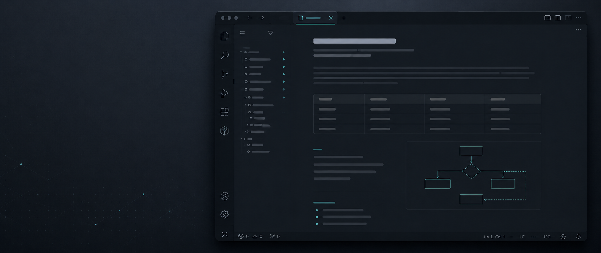
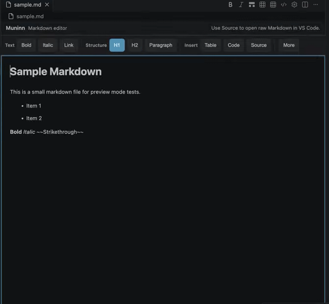

# Muninn for VS Code

Muninn provides a reading-first Markdown experience in VS Code with a custom editor as the default for `.md` and `.markdown` files.



## Preview



## Highlights

- Custom markdown editor (`muninn.markdownEditor`) opens by default.
- Single-pane rich editing toolbar with grouped Text/Structure/Insert actions.
- Mermaid block insertion with inline preview panel and guarded rendering.
- In-editor tables with editable grid controls, source toggle, and keyboard-friendly cell navigation.
- Paste, drag, or command-insert image files into markdown with workspace-local storage.
- Source button and command for opening raw Markdown in VS Code.
- Workspace trust-aware Mermaid gating.
- No telemetry.

## Commands

- `muninn.openRawMarkdown`
- `muninn.toggleBold`
- `muninn.toggleItalic`
- `muninn.setHeading1`
- `muninn.setHeading2`
- `muninn.setHeading3`
- `muninn.setParagraph`
- `muninn.toggleBulletList`
- `muninn.toggleNumberedList`
- `muninn.insertLink`
- `muninn.insertMermaidBlock`
- `muninn.insertTable`
- `muninn.insertCodeBlock`
- `muninn.insertImage`
- `muninn.addTableRow`
- `muninn.addTableColumn`
- `muninn.tableActions`
- `muninn.inspectConfiguration`

## Settings

- `muninn.editorAssociations`
- `muninn.integrations.mermaid.enabled`
- `muninn.integrations.mermaid.allowInUntrustedWorkspaces`
- `muninn.toolbar.mode` (`basic` or `advanced`)
- `muninn.images.destination` (`images/` by default, relative to the current markdown document)

## Security

- [Security policy](SECURITY.md)
- [Security posture](docs/SECURITY_POSTURE.md)

## Development

```bash
npm ci
npm run compile
npm run bundle
npm run lint
npm run format:check
npm run typecheck
npm test
npm run test:e2e
```

## Packaging

```bash
npm run package
```

## License

GNU Affero General Public License v3.0 (AGPL-3.0-only). See [LICENSE](LICENSE).

### License — plain language

Using Muninn to edit files imposes nothing on those files, your employer's code, or any repository you open.
Your markdown, and anything you write with Muninn, is yours.
The AGPL governs copying, distributing, or modifying Muninn itself.
If you distribute a modified Muninn, share it under the same license and keep required notices.
If you serve a modified Muninn through hosted VS Code environments such as code-server, Codespaces, or Gitpod, offer users the source for that modified Muninn.
Redistributing unmodified Muninn keeps the [LICENSE](LICENSE) and notices with the extension.
Common-understanding summary, not legal advice; the [LICENSE](LICENSE) text governs.
