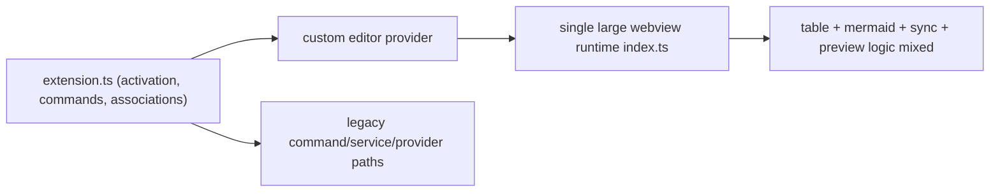
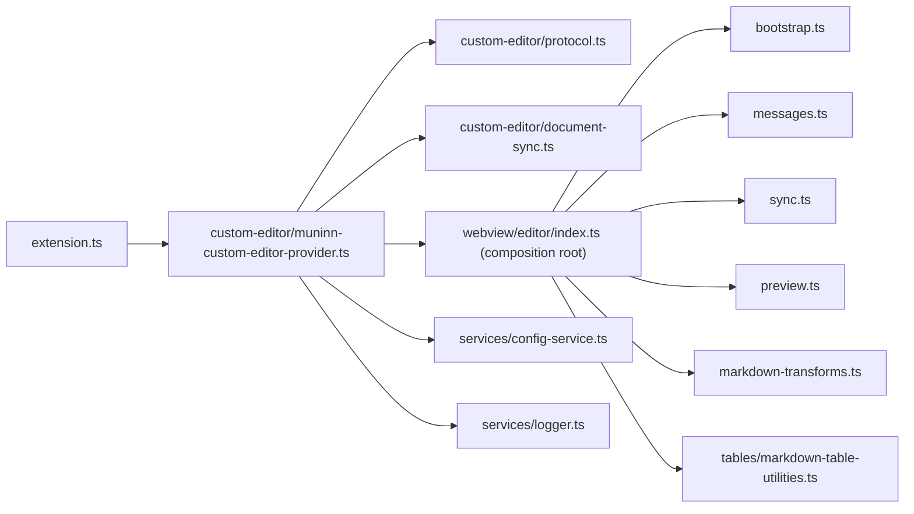

# REFACTOR_REPORT

## Executive Summary

This refactor completed the Phase 0-5 plan with behavior-preserving structural cleanup, security tightening, and stronger quality gates.

Primary outcomes:

1. Refactored the webview runtime from a monolith into focused modules while preserving command/protocol behavior.
2. Standardized host/view boundaries around typed protocol guards and explicit sync/preview controllers.
3. Tightened webview security (`localResourceRoots` scoped to `/media`, CSP and message validation retained).
4. Removed legacy/undesired modules and obsolete tests with reference-proof cleanup.
5. Completed tooling and CI gate alignment for lint/format/typecheck/tests/coverage/no-telemetry.
6. Added missing unit and integration coverage for `DocumentSync`, sanitizer behavior, and table action routing.

## Best-Practice Comparison Highlights (Adopted)

Compared to mature VS Code extension repos and official examples, this repo now aligns on:

1. Thin activation entrypoint with explicit command table and disposable ownership.
2. Runtime validation at trust boundaries (webview message channel).
3. Clear separation of host APIs vs editor runtime internals.
4. Strict reproducible gates in CI and release workflows.
5. Security-first webview defaults (least-resource roots, strict CSP, explicit sanitization).

## Standards Introduced

Repository standards are defined in:

- `/Users/aymenhammouda/workspace/markdown-reader/QUALITY_BASELINE.md`

## Architecture (Before/After)

### Before

### After

## Behavior Changes

None intended.

No command IDs, settings keys, custom editor view type, or supported VS Code engine range were changed.

## Risk Assessment and Compatibility Notes

1. **Compatibility**: Engine remains `^1.85.0`; command/settings surface remains `muninn.*`.
2. **Security**: Controls were tightened/preserved, not relaxed (CSP, message guards, sanitizer, trust gating).
3. **Runtime risk**: Webview module split was behavior-preserving but broad; mitigated by integration + E2E regression coverage.
4. **Coverage policy risk**: Unit coverage scope intentionally excludes bundled webview runtime paths and relies on integration/E2E for those runtime behaviors.

## Validation

The following checks were executed and passing:

1. `npm run format:check`
2. `npm run lint`
3. `npm run typecheck`
4. `npm run compile`
5. `npm run coverage`
6. `npm test`
7. `npm run test:e2e`
8. `npm run check:no-telemetry`

## Removed Legacy/Undesired Code

Removed items and evidence:

1. Legacy command/service stack deleted:

- `/Users/aymenhammouda/workspace/markdown-reader/src/commands/format-commands.ts`
- `/Users/aymenhammouda/workspace/markdown-reader/src/commands/mode-commands.ts`
- `/Users/aymenhammouda/workspace/markdown-reader/src/services/formatting-service.ts`
- `/Users/aymenhammouda/workspace/markdown-reader/src/services/preview-service.ts`
- `/Users/aymenhammouda/workspace/markdown-reader/src/services/state-service.ts`
- `/Users/aymenhammouda/workspace/markdown-reader/src/services/validation-service.ts`
- Evidence: `rg "formatting-service|preview-service|state-service|validation-service|format-commands|mode-commands" src tests package.json` -> no references.

2. Legacy handler/UI paths deleted:

- `/Users/aymenhammouda/workspace/markdown-reader/src/handlers/markdown-file-handler.ts`
- `/Users/aymenhammouda/workspace/markdown-reader/src/ui/title-bar-controller.ts`
- `/Users/aymenhammouda/workspace/markdown-reader/src/types/state.ts`
- Evidence: `rg "markdown-file-handler|title-bar-controller|types/state" src tests package.json` -> no references.

3. Unused provider paths removed and de-scoped:

- `/Users/aymenhammouda/workspace/markdown-reader/src/providers/drop-edit-provider.ts`
- `/Users/aymenhammouda/workspace/markdown-reader/src/providers/smart-paste-provider.ts`
- Evidence: no command/contribution/registration references in `package.json` or `src/**`; `rg "drop-edit-provider|smart-paste-provider|src/providers" src tests package.json` -> no references.

4. Obsolete test harness paths replaced:

- `/Users/aymenhammouda/workspace/markdown-reader/tests/integration/*`
- `/Users/aymenhammouda/workspace/markdown-reader/tests/run-test.ts`
- `/Users/aymenhammouda/workspace/markdown-reader/tests/suite/*`
- Replaced by `/Users/aymenhammouda/workspace/markdown-reader/tests/integration-cli/*` and modernized unit/E2E structure.

5. Deprecated/undesired configuration leftovers removed:

- Legacy `.eslintrc.json` deleted in favor of current ESLint configuration stack already in repository.

## Comment Policy Outcome

Outcome:

1. Removed noisy file-overview comments across core/webview modules.
2. Kept only comments with operational value (security/tradeoff context).
3. Moved rationale and onboarding guidance into docs (`README`, `docs/*`, `MANUAL_QA.md`, this report, and `QUALITY_BASELINE.md`).

## LOC Impact Summary

### Net change (rough, based on current diff)

- Source + tests total: `+3993 / -6960` (`net -2967`)
- Full repository diff including tooling/docs/lockfile updates: `+20649 / -13590` (`net +7059`)

### By category (required)

1. **Deleted** (legacy/undesired code + obsolete tests): roughly `-5k` lines.
2. **Moved/Reorganized** (module boundary reshaping, test harness migration): roughly neutral (`~0` net, structure-oriented).
3. **Consolidated** (shared table transforms, sync/message/preview helpers, comment-light cleanup): roughly `-1k` net in maintained source areas.

### Per-area rough impact (required)

1. Core host (`src` excluding webview): `net -1402`
2. UI/webview runtime (`src/webview`): `net +1927` (split monolith into explicit modules)
3. Integrations (`src/integrations`): `net +21`
4. Tests (`tests/unit|integration-cli|e2e`): `net -3513`
5. Tooling/docs (scripts/workflows/config/docs/lockfile): `net +10000+` (dominated by lockfile and documentation refresh)

### Why Not Shorter (required)

1. Kept explicit protocol guards instead of compressing into generic dynamic dispatch, to preserve type safety and malformed-message rejection.
2. Kept explicit `DocumentSync` revision checks and result codes to avoid hidden race/error behavior.
3. Kept explicit sanitizer node/attribute loops to keep security logic auditable and avoid brittle regex shortcuts.
4. Kept command registration table explicit to preserve stable command IDs and discoverability.
5. Kept integration/E2E assertions verbose for reproducibility and debuggability across CI environments.

## How To Run

1. `npm ci`
2. `npm run format:check`
3. `npm run lint`
4. `npm run typecheck`
5. `npm run compile`
6. `npm run coverage`
7. `npm test`
8. `npm run test:e2e`
9. `npm run check:no-telemetry`

## Follow-ups (Deliberate Non-goals)

1. Further decomposition of `muninn-custom-editor-provider.ts` into smaller host-side modules.
2. Additional browser-level tests for more Mermaid rendering edge cases.
3. Optional performance profiling pass for very large markdown documents.

## References

### Context7 MCP

1. [VS Code Webview Guide](https://code.visualstudio.com/api/extension-guides/webview)
2. [VS Code Activation Events](https://code.visualstudio.com/api/references/activation-events)
3. [VS Code Testing Extensions](https://code.visualstudio.com/api/working-with-extensions/testing-extension)

### Microsoft Learn MCP

1. [Secure the developer environment for Zero Trust](https://learn.microsoft.com/security/zero-trust/develop/secure-dev-environment-zero-trust)
2. [Using Content Security Policy (CSP) to control which resources can be run](https://learn.microsoft.com/microsoft-edge/extensions/developer-guide/csp)

Inference note: Microsoft Learn MCP search did not return VS Code extension API pages with adequate depth for activation/testing implementation details, so those implementation specifics are sourced from official VS Code docs via Context7; Learn sources were used for security hardening posture and CSP policy framing.
