# Markdown Reader - Roadmap Diagrams

Visual representations of the project roadmap for the Markdown Reader VS Code extension.

**Development Workflow**: Setup First → Milestone-Driven with Test Gates

---

## Milestone Gate Flow

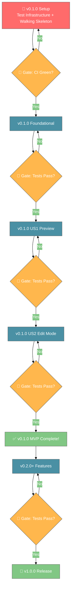

**Key**: 🧪 = Test Gate (BLOCKING) | ❌ = Fix before proceeding

---

## Timeline Evolution

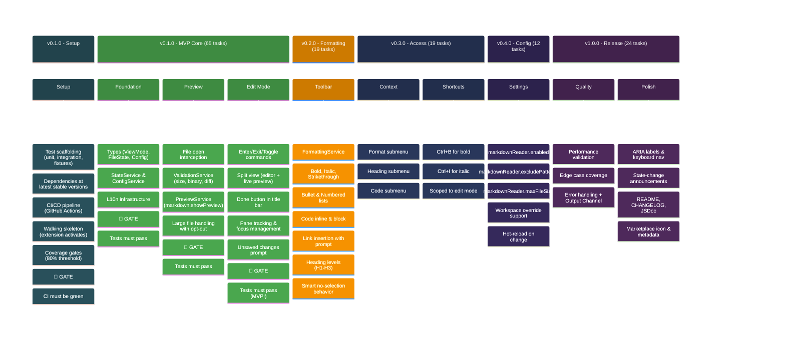

---

## Feature Dependency Graph

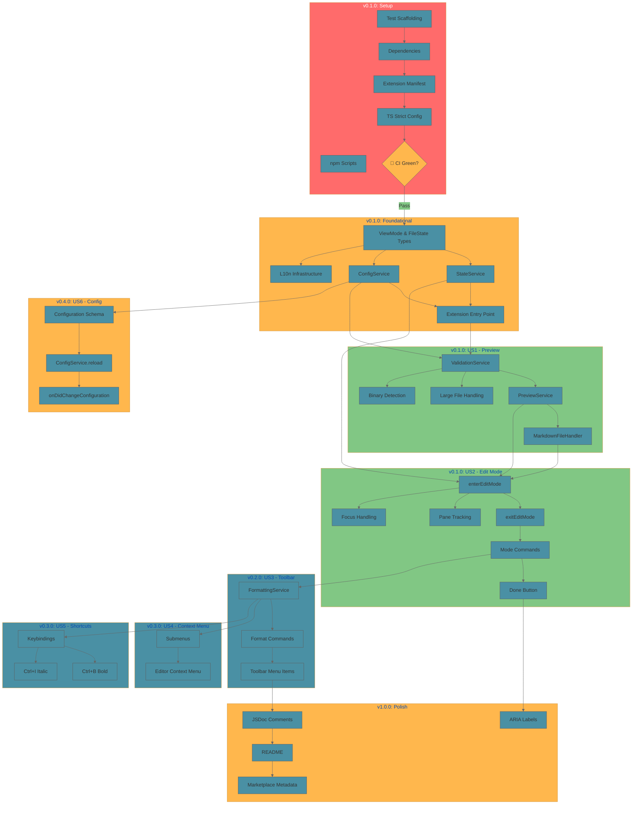

---

## Task Distribution

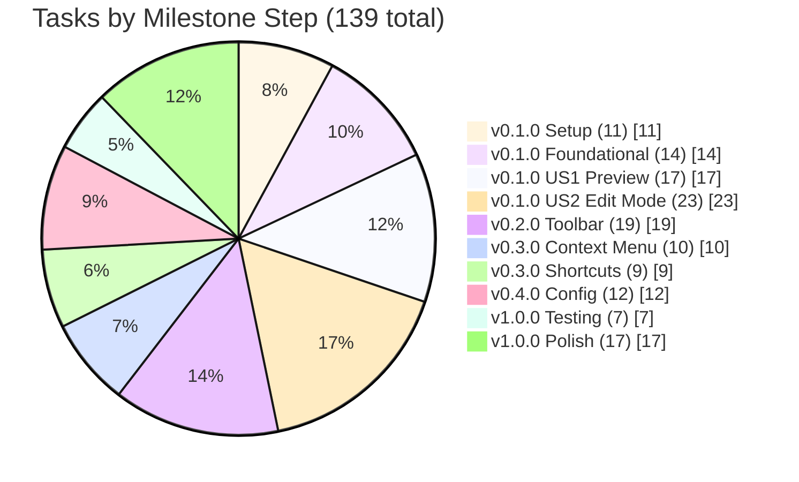

---

## MVP vs Post-MVP

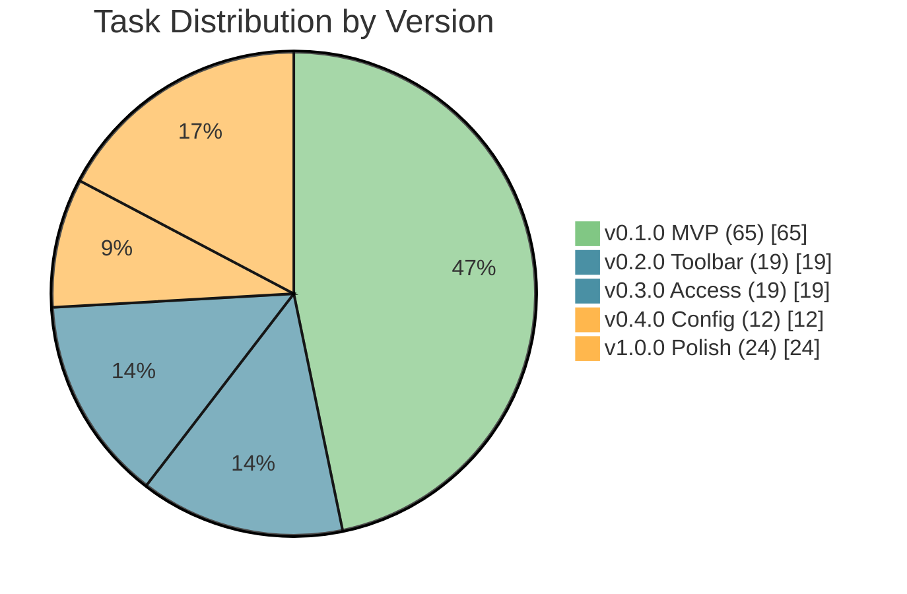

---

## User Story Dependencies

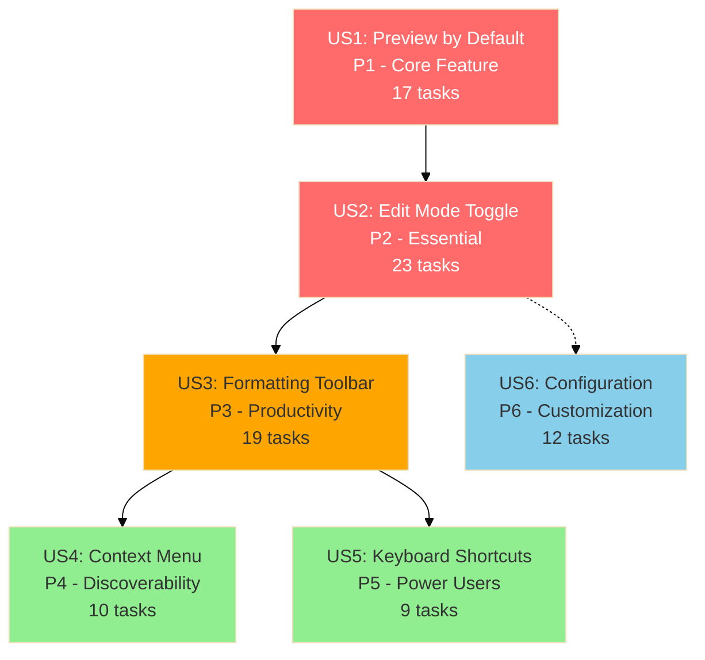

**Legend:**
- :red_circle: MVP (v0.1.0) - Must have
- :orange_circle: Core (v0.2.0) - Should have
- :green_circle: Nice (v0.3.0) - Could have
- :blue_circle: Config (v0.4.0) - Nice to have

---

## Priority/Effort Quadrant

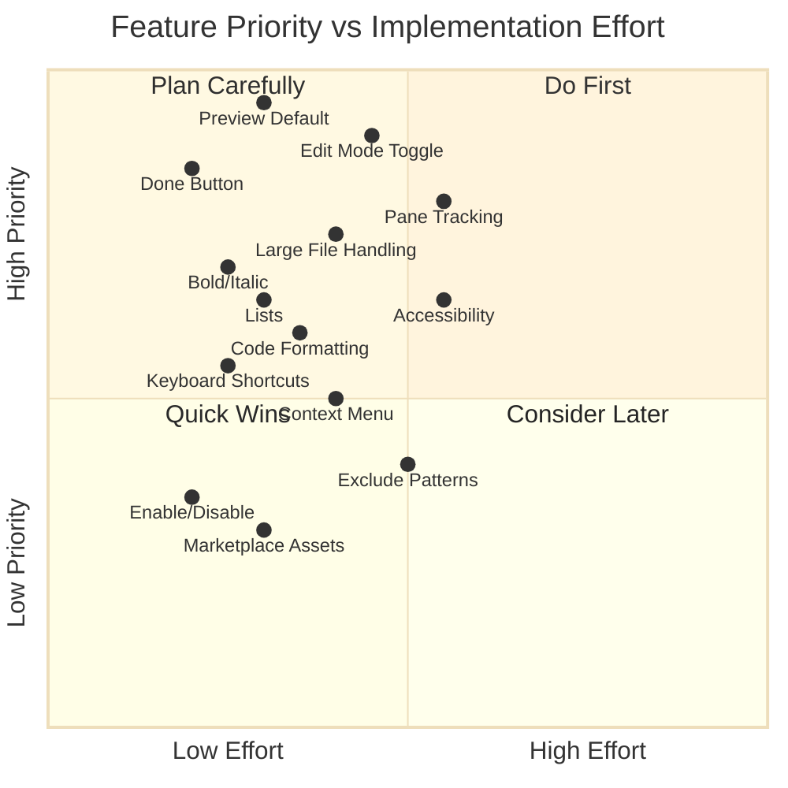

---

## User Journey

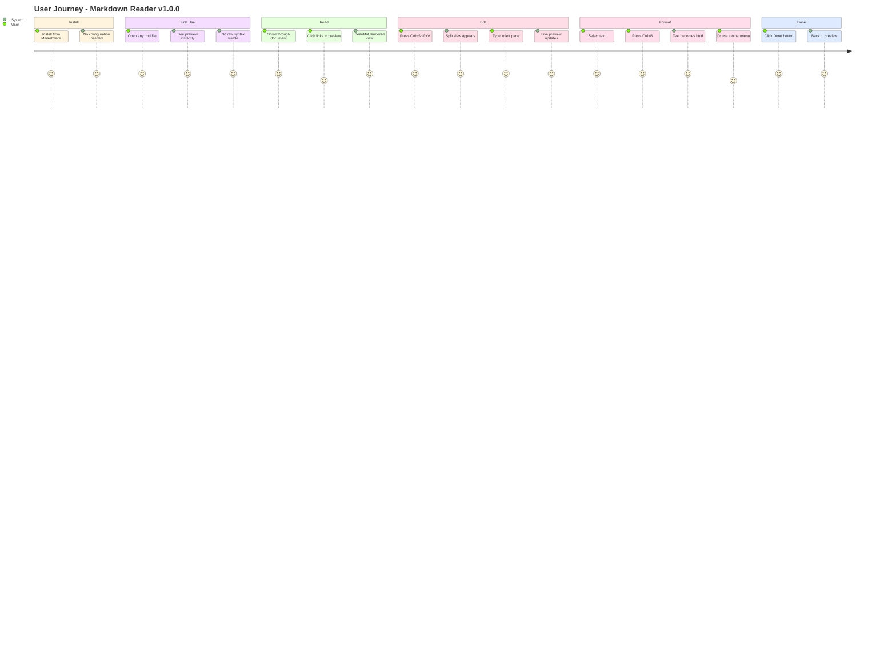

---

## File Open Flow

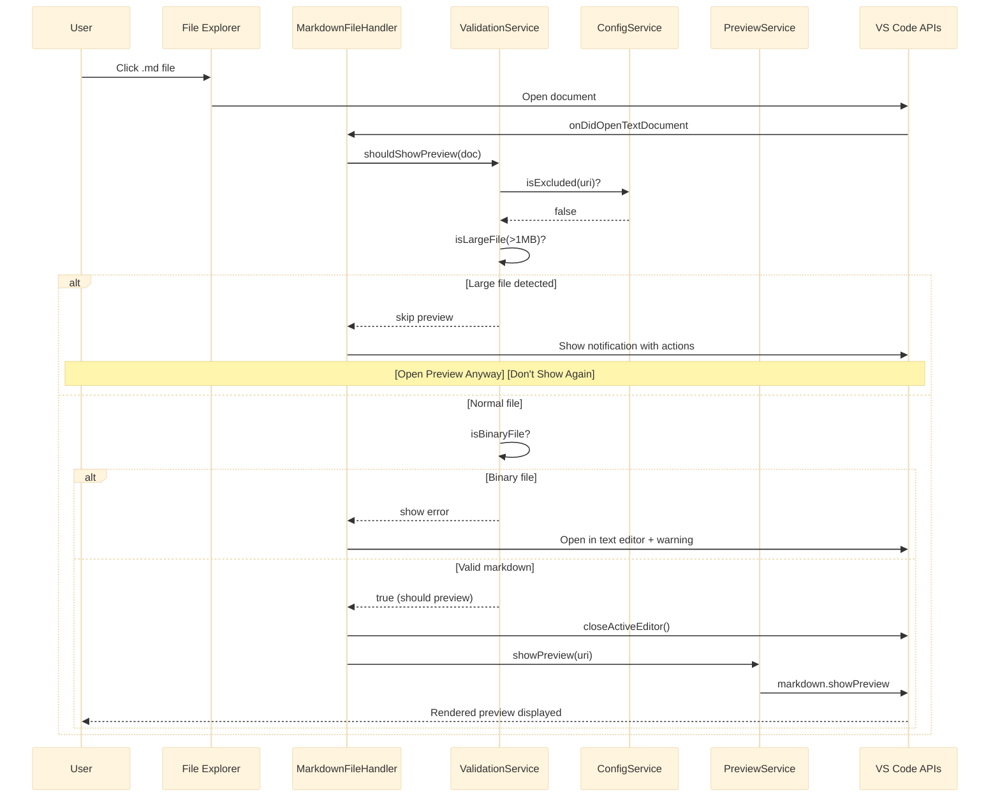

---

## Edit Mode Toggle Flow

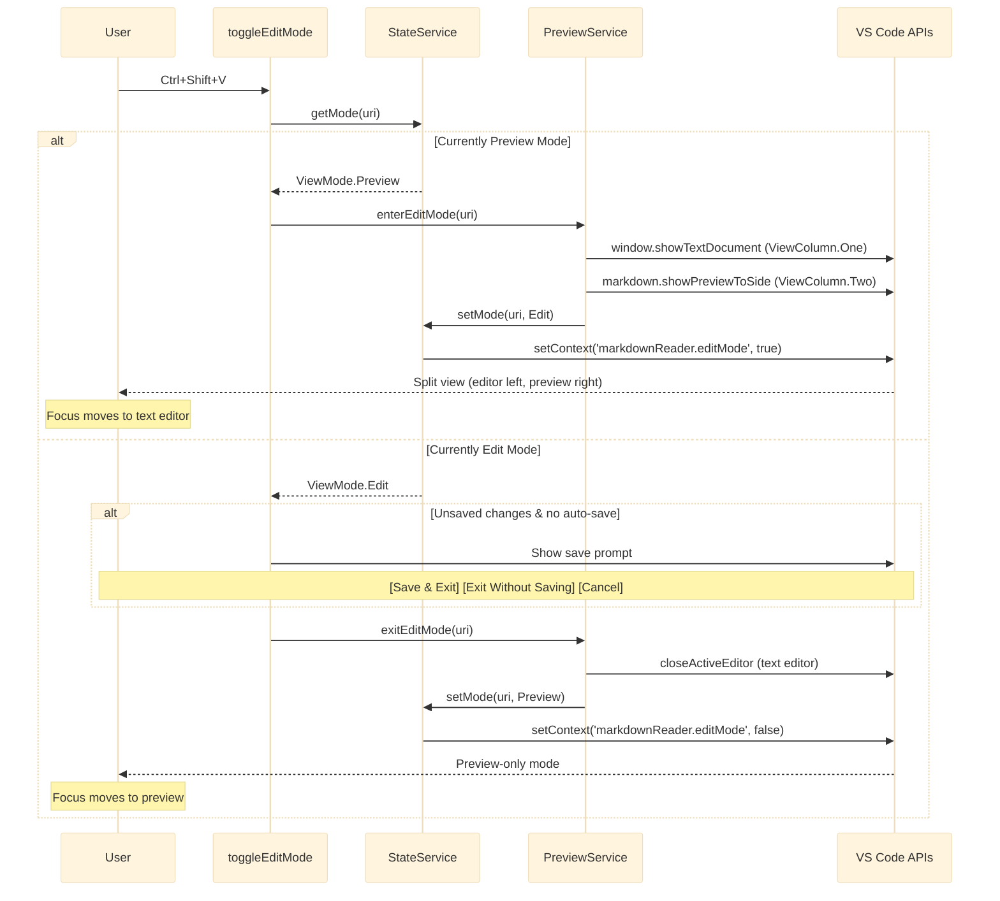

---

## Architecture (v1.0.0 Target)

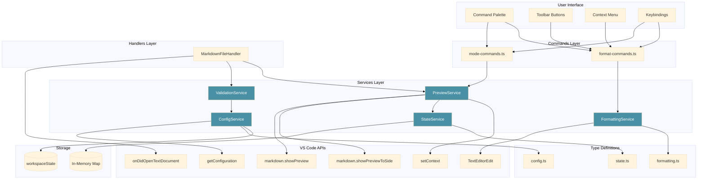

---

## Parallel Execution Opportunities

```mermaid
%%{init: {'theme': 'base'}}%%

flowchart LR
    subgraph Setup ["v0.1.0: Setup"]
        direction TB
        T001[T001: Test scaffolding]
        T002[T002: Dependencies]
        T003[T003: npm scripts]
        T004[T004: nyc config]

        subgraph parallel1 ["Can run in parallel"]
            T005[T005: ESLint]
            T006[T006: Prettier]
            T007[T007: Manifest]
            T008[T008: Source tree]
            T009[T009: tsconfig]
            T010[T010: launch.json]
            T011[T011: CI workflows]
        end
    end

    T001 --> T002 --> T003 --> T004 --> parallel1
    parallel1 --> G0{🧪 CI Green?}

    subgraph Foundational ["v0.1.0: Foundational"]
        direction TB
        subgraph parallel2a ["Types (parallel)"]
            T012[T012: state.ts]
            T013[T013: config.ts]
            T014[T014: formatting.ts]
        end

        subgraph parallel2b ["Fixtures (parallel)"]
            T018[T018: sample.md]
            T019[T019: git-conflict.md]
            T139[T139: l10n setup]
        end

        subgraph parallel2c ["Tests (parallel)"]
            T021[T021: state tests]
            T022[T022: config tests]
        end
    end

    G0 -->|Pass| parallel2a
    parallel2a --> parallel2b
    parallel2b --> parallel2c

    style Setup fill:#ff6b6b,color:#fff
    style G0 fill:#FFB74D
```

---

*These diagrams are best viewed with Mermaid-compatible markdown renderers (GitHub, GitLab, VS Code with Mermaid extension).*

*Roadmap Diagrams v1.2 - milestone methodology with test gates*
*Synced with tasks.md (139 tasks, 65 MVP)*
