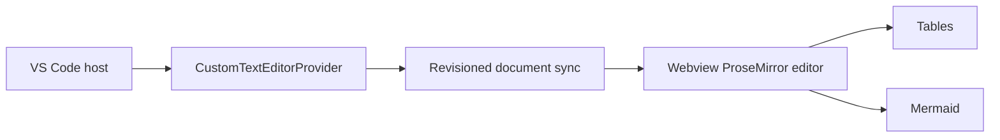

# AI Agent Guide

Repository instructions for AI coding agents working on Muninn for VS Code.

## Product Reality

Muninn v2 is a VS Code custom Markdown editor. It is not the old preview-mode extension.

- Custom editor id: `muninn.markdownEditor`.
- Host entry: `src/extension.ts`.
- Custom editor provider: `src/custom-editor/muninn-custom-editor-provider.ts`.
- Message protocol and guards: `src/custom-editor/protocol.ts`.
- Webview editor: `src/webview/editor/`.
- Table node view: `src/webview/editor/nodes/table-node-view.ts`.
- Mermaid rendering: `src/webview/editor/preview.ts` and `src/webview/editor/renderers/mermaid-renderer.ts`.



## Prime Directive

Do not introduce unrelated Markdown serialization churn.

When changing parsing, serialization, tables, source toggling, or document sync, add or update round-trip coverage. If exact round-trip behavior is impossible, document the deviation.

## Required Checks

Run the smallest relevant checks while developing, then the broader set before PR handoff:

```bash
npm run lint
npm run format:check
npm run typecheck
npm run coverage
npm run test:e2e
```

If a check is not runnable in your environment, say exactly which one and why.

## Forbidden Without Explicit Issue Scope

- Telemetry.
- Network calls at runtime.
- `eval` or script execution from document content.
- Weakening CSP, nonce handling, or workspace-trust gates.
- Replacing the custom editor with VS Code's built-in Markdown preview flow.
- Adding a second Markdown editor architecture.
- Silent Markdown normalization unrelated to the user's edit.

## User-Facing Text

Use the existing localization pattern. Do not hardcode new user-visible strings in the webview or extension host if the surrounding code uses localized bundles.

## Public Claims

Do not add README or Marketplace claims that are not supported by shipped code or committed docs.
