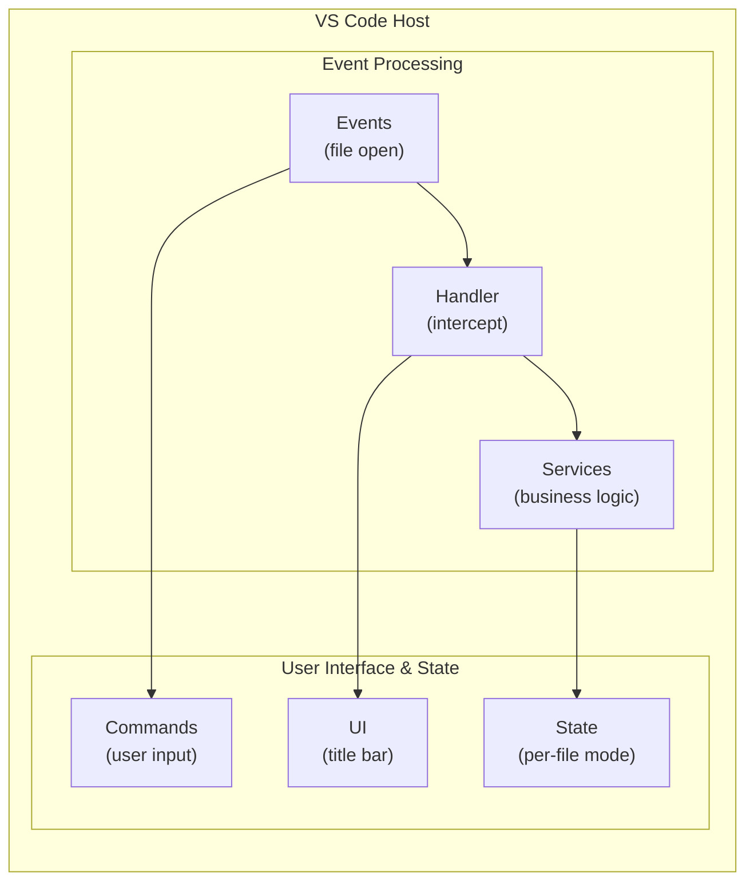
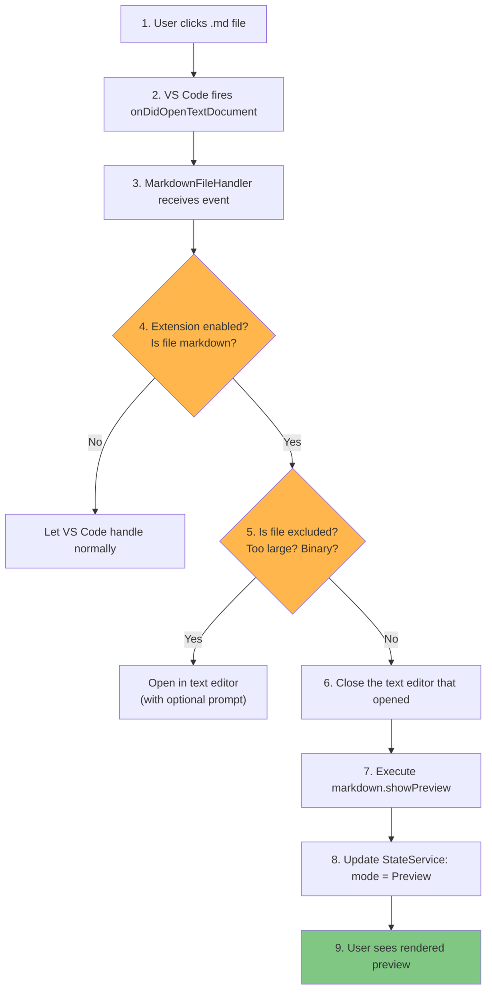
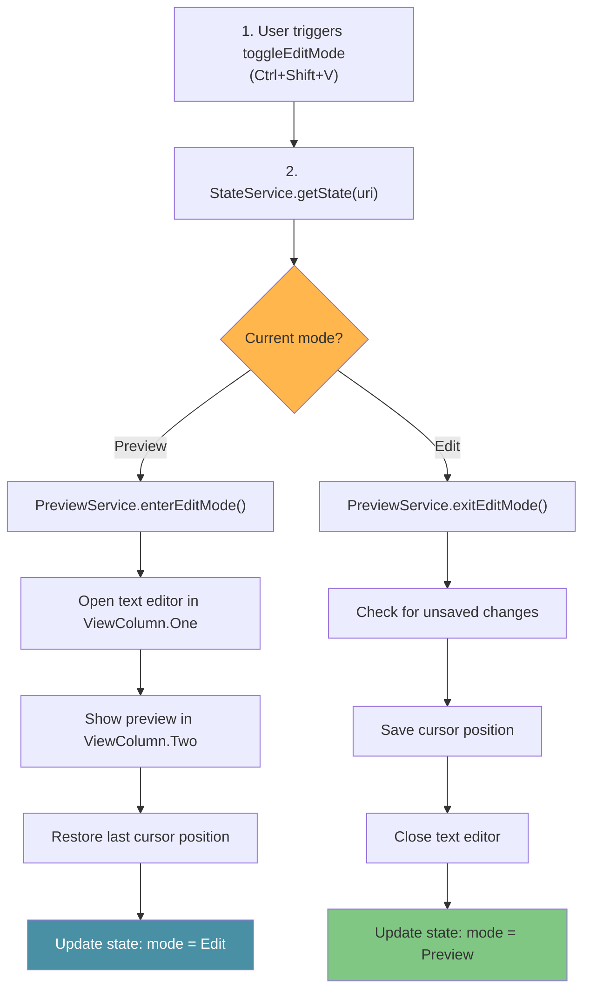

# Architecture

This document describes the architecture of the Markdown Preview extension, explaining how the different components work together to provide a seamless reading-first experience for markdown files.

## Table of Contents

- [Overview](#overview)
- [Design Principles](#design-principles)
- [Module Structure](#module-structure)
- [Data Flow](#data-flow)
- [Key Components](#key-components)
- [State Management](#state-management)
- [Configuration System](#configuration-system)
- [Error Handling](#error-handling)
- [Extension Points](#extension-points)

## Overview

The extension intercepts markdown file opens and redirects them to VS Code's native markdown preview. It maintains per-file state to track whether each file is in preview mode or edit mode, and provides formatting tools for when users need to edit.



## Design Principles

### 1. Native Integration (P-NI)
- Uses VS Code's built-in `markdown.showPreview` command
- No custom webviews or markdown parsers
- Leverages VS Code's theme system and accessibility features

### 2. Reading-First Experience (P-RF)
- Preview mode is the default state
- Zero UI additions when in preview mode
- Edit mode is opt-in via explicit user action

### 3. Non-Intrusive Design (P-ND)
- Respects user intent (manual editor opens stay in edit mode)
- No auto-return to preview on save
- Configurable exclusion patterns for specific workflows

### 4. Zero Configuration (P-ZC)
- Works immediately after installation
- Sensible defaults for all settings
- Configuration is optional enhancement

## Module Structure

### Entry Point

**`src/extension.ts`**
- Activates on `onLanguage:markdown` event
- Creates and wires all service instances
- Registers commands, event listeners, and disposables
- Single responsibility: dependency injection and lifecycle management

```typescript
// Simplified activation flow
export function activate(context: ExtensionContext) {
  // 1. Create services
  const stateService = new StateService();
  const configService = new ConfigService();
  // ... more services

  // 2. Create handlers and controllers
  const fileHandler = new MarkdownFileHandler(...);
  const titleBarController = new TitleBarController(...);

  // 3. Register commands
  context.subscriptions.push(
    commands.registerCommand('markdownReader.enterEditMode', ...),
    // ... more commands
  );

  // 4. Start listening
  fileHandler.register();
  titleBarController.register();
}
```

### Services Layer

Services contain the core business logic and are designed to be testable in isolation.

| Service | Responsibility | Dependencies |
|---------|---------------|--------------|
| `PreviewService` | Preview/edit mode transitions, large file prompts | StateService, ConfigService, ValidationService |
| `StateService` | Per-file mode tracking, cursor position memory | None |
| `ConfigService` | Settings access with caching and scope resolution | None |
| `ValidationService` | File type detection, size checks, conflict markers | None |
| `FormattingService` | Text transformations (bold, lists, etc.) | None |
| `Logger` | Output channel logging for diagnostics | OutputChannel |

### Handlers Layer

**`src/handlers/markdown-file-handler.ts`**
- Listens to `onDidOpenTextDocument` events
- Debounces rapid file opens (75ms)
- Decides whether to show preview or edit mode
- Shows one-time welcome message

### Commands Layer

**`src/commands/mode-commands.ts`**
- `enterEditMode`: Opens split view
- `exitEditMode`: Returns to preview-only
- `toggleEditMode`: Switches between modes

**`src/commands/format-commands.ts`**
- Thin wrappers around FormattingService methods
- Each command maps to a single formatting action

### UI Layer

**`src/ui/title-bar-controller.ts`**
- Keeps context keys synchronized with state
- Enables/disables toolbar buttons based on mode
- Updates `markdownReader.editMode` context key

## Data Flow

### File Open Flow



### Preview Decision Matrix

| Check | Outcome | Rationale |
|-------|---------|-----------|
| Extension disabled | Skip preview | Respect user or workspace settings |
| Non-markdown / diff view | Skip preview | Avoid hijacking non-target files |
| Excluded pattern | Skip preview | Allow opt-out for repos or folders |
| Large file | Prompt user | Prevent UI slowdowns and memory spikes |
| Binary file | Open editor | Avoid unreadable preview output |
| Conflict markers | Open edit mode | Ensure conflicts are visible |

### Mode Toggle Flow



## State Management

### FileState Interface

```typescript
interface FileState {
  uri: string;              // File URI as string (Map key)
  mode: ViewMode;           // 'preview' | 'edit'
  lastModeChange: number;   // Timestamp of last mode change
  editorVisible?: boolean;  // Is the text editor pane visible?
  lastSelection?: {         // Cursor position for restoration
    line: number;
    character: number;
  };
}
```

### State Lifecycle

1. **Created:** When a markdown file first opens
2. **Updated:** On mode changes, cursor moves, visibility changes
3. **Cleared:** When file is closed or deleted

### Context Keys

The extension sets VS Code context keys to control UI visibility:

| Context Key | Type | Purpose |
|-------------|------|---------|
| `markdownReader.editMode` | boolean | Show/hide formatting toolbar |
| `markdownReader.enabled` | boolean | Extension enabled state |
| `markdownReader.isMarkdown` | boolean | Current file is markdown |

## Configuration System

### Settings Hierarchy

Settings are resolved in order of specificity:

1. **Workspace Folder** (`workspaceFolderValue`) - Most specific
2. **Workspace** (`workspaceValue`)
3. **User** (`globalValue`)
4. **Default** (`defaultValue`) - Least specific

### Caching Strategy

```typescript
class ConfigService {
  private readonly cachedConfigs = new Map<string, ExtensionConfiguration>();

  getConfig(resource?: Uri): ExtensionConfiguration {
    const cacheKey = resource?.toString() ?? '__global__';
    // Return cached or load fresh
  }

  clearCache(): void {
    // Called on configuration change events
  }
}
```

### Pattern Matching

Exclusion patterns use `minimatch` with these options:
- `dot: true` - Matches dotfiles
- `nocase: true` - Case-insensitive on Windows

## Performance Considerations

- **Debounced open events:** File opens are debounced (75ms) to prevent duplicate
  work when VS Code restores sessions or when users click rapidly.
- **Large file guardrails:** Large files require explicit confirmation to avoid
  sluggish preview rendering.
- **Binary detection:** Files with null bytes are treated as binary and skipped.

## Error Handling

### Error Categories

1. **Preview Failures:** Caught and logged, fallback to text editor
2. **Validation Errors:** User-friendly messages with actions
3. **Configuration Errors:** Graceful fallback to defaults

### Logging Strategy

All significant events are logged to the "Markdown Reader" output channel:

```typescript
// Severity levels
logger.info('Informational message');   // Normal operations
logger.warn('Warning message');         // Recoverable issues
logger.error('Error message', error);   // Failures with stack trace
```

### User Notifications

| Scenario | Notification Type | Actions |
|----------|------------------|---------|
| Large file detected | Information | "Open Preview Anyway", "Don't Show Again" |
| Binary file detected | Error | None |
| Preview failed | Error | "Open in Editor" |
| Conflict markers | Warning | Opens in edit mode automatically |

## Extension Points

### Adding New Formatting Commands

1. Add command definition in `package.json`
2. Create handler function in `format-commands.ts`
3. Use `FormattingService` methods for text manipulation
4. Register command in `extension.ts`

### Adding New Validation Checks

1. Add method to `ValidationService`
2. Call from `MarkdownFileHandler.processDocumentOpen()`
3. Handle result appropriately (skip preview, show message, etc.)

### Adding New Settings

1. Define in `package.json` under `contributes.configuration`
2. Add to `ExtensionConfiguration` interface
3. Update `ConfigService.loadConfig()` to read the setting
4. Use via `configService.getConfig(uri).newSetting`

## Related Documentation

- [DEVELOPMENT.md](DEVELOPMENT.md) - Development setup and workflow
- [TESTING.md](TESTING.md) - Test architecture and practices
- [Project Constitution](../.specify/memory/constitution.md) - Design principles in detail
