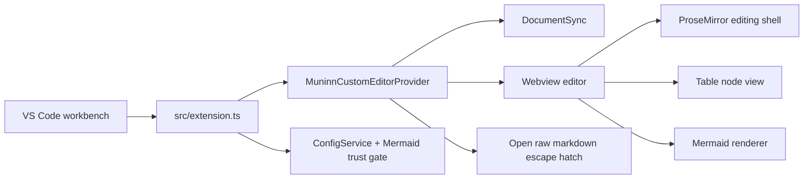

# Architecture

Muninn is a desktop-first VS Code custom editor for markdown. The custom editor is the product, not a wrapper around the native preview.

## Runtime Overview

```mermaid
flowchart LR
  A["VS Code workbench"] --> B["src/extension.ts"]
  B --> C["MuninnCustomEditorProvider"]
  B --> D["ConfigService + Mermaid trust gate"]
  C --> E["DocumentSync"]
  C --> F["Webview editor"]
  F --> G["ProseMirror editing shell"]
  F --> H["Table node view"]
  F --> I["Mermaid renderer"]
  C --> J["Open raw markdown escape hatch"]
```

## Source Files

- `src/extension.ts`
  Registers commands, wires configuration changes, and registers the custom editor provider.
- `src/custom-editor/muninn-custom-editor-provider.ts`
  Owns the VS Code custom editor lifecycle, message bridge, and raw-markdown fallback.
- `src/custom-editor/document-sync.ts`
  Applies revisioned full-document updates between the host and the active webview.
- `src/custom-editor/protocol.ts`
  Defines typed host/webview messages and runtime guards.
- `src/webview/editor/index.ts`
  Boots the ProseMirror editor, command handling, toolbar state, and host sync.
- `src/webview/editor/nodes/table-node-view.ts`
  Implements the table editing surface while preserving markdown round-tripping.
- `src/webview/editor/renderers/mermaid-renderer.ts`
  Renders Mermaid diagrams when the host allows it.
- `src/integrations/mermaid-adapter.ts`
  Applies workspace-trust-aware Mermaid enablement rules.

## Activation Model

- Markdown files are owned by the `muninn.markdownEditor` custom editor contribution.
- User-facing commands also activate the extension when invoked.
- Muninn does not mutate `workbench.editorAssociations` on startup.

## Message Flow

1. The webview posts `view.ready`.
2. The host responds with `host.init` containing markdown, revision, config-derived state, and Mermaid enablement.
3. Webview edits queue `view.applyDocument` messages through the revisioned sync controller.
4. The host applies edits to the backing `TextDocument`.
5. Host-side document changes are rebroadcast as `host.documentChanged`.
6. Host-initiated actions, such as opening raw markdown, travel back through `host.executeCommand`.

## Security Notes

- The webview uses a strict CSP with nonce-based scripts.
- Inbound webview messages are validated before they are handled.
- Mermaid rendering stays disabled in restricted workspaces unless the user explicitly allows it.
- `muninn.openRawMarkdown` remains available as the escape hatch for unsupported or advanced edits.
