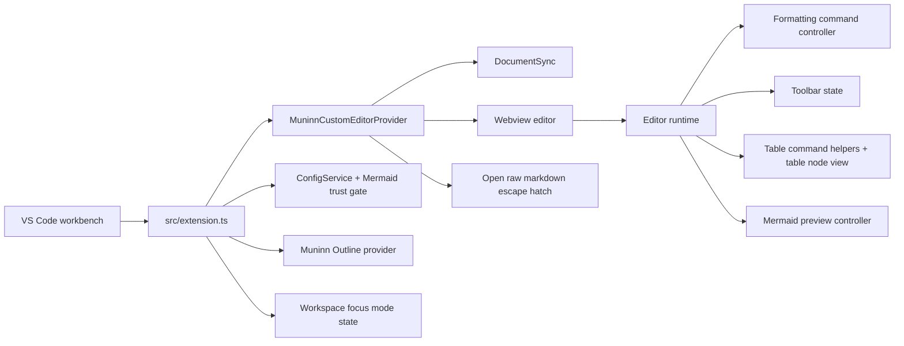

# Architecture

Muninn is a desktop-first VS Code custom editor for markdown. The custom editor is the product, not a wrapper around the native preview.

## Runtime Overview

```mermaid
flowchart LR
  A["VS Code workbench"] --> B["src/extension.ts"]
  B --> C["MuninnCustomEditorProvider"]
  B --> D["ConfigService + Mermaid trust gate"]
  B --> K["Muninn Outline provider"]
  B --> L["Workspace focus mode state"]
  C --> E["DocumentSync"]
  C --> F["Webview editor"]
  F --> G["Editor runtime"]
  G --> H["Formatting command controller"]
  G --> I["Toolbar state"]
  G --> M["Table command helpers + table node view"]
  G --> N["Mermaid preview controller"]
  C --> J["Open raw markdown escape hatch"]
```

## Source Files

- `src/extension.ts`
  Registers commands, wires configuration changes, and registers the custom editor provider.
- `src/custom-editor/muninn-custom-editor-provider.ts`
  Owns the VS Code custom editor lifecycle, message bridge, and raw-markdown fallback.
- `src/custom-editor/document-sync.ts`
  Applies revisioned full-document updates between the host and the active webview.
- `src/custom-editor/protocol.ts`
  Defines typed host/webview messages and runtime guards.
- `src/custom-editor/focus-mode-state.ts`
  Persists the last-used focus mode UI state in workspace state.
- `src/outline/markdown-outline.ts`
  Parses headings from the current markdown document and shapes the native outline tree.
- `src/outline/muninn-outline-provider.ts`
  Provides the Explorer `Muninn Outline` tree and section commands.
- `src/webview/editor/index.ts`
  Boots the webview app and delegates runtime behavior to `editor-runtime.ts`.
- `src/webview/editor/editor-runtime.ts`
  Wires host messages, document sync, toolbar events, ProseMirror state, and optional preview controllers.
- `src/webview/editor/formatting-commands.ts`
  Handles heading, paragraph, list, mark, link, code block, section reveal, and host-driven editor commands.
- `src/webview/editor/table-commands.ts`
  Handles command-driven table insertion and table row/column mutations.
- `src/webview/editor/toolbar-state.ts`
  Defines toolbar visibility, transient command feedback, and status-line selection summaries.
- `src/webview/editor/nodes/table-node-view.ts`
  Implements the table editing surface while preserving markdown round-tripping.
- `src/webview/editor/preview.ts`
  Owns the trust-gated Mermaid preview controller, lazy renderer loading, and SVG sanitization.
- `src/webview/editor/renderers/mermaid-renderer.ts`
  Renders Mermaid diagrams when the host allows it. This module is loaded through a dynamic import so Mermaid stays out of the initial webview payload.
- `src/integrations/mermaid-adapter.ts`
  Applies workspace-trust-aware Mermaid enablement rules.

## Webview Bundle

- `esbuild.mjs` emits the webview as ESM so dynamic imports become separate files under `media/chunks/`.
- `scripts/bundle-budget.mjs` reads the esbuild metafile, writes `media/bundle-metadata.json`, and fails the build if the initial webview script plus CSS exceeds the milestone-4 budget.
- The current budget is based on the milestone-3 production payload baseline and requires at least a 25% reduction in the initial webview payload.
- Mermaid is intentionally loaded only after the editor needs to render a selected Mermaid code block.

## Activation Model

- Writable Markdown files are owned by the `muninn.markdownEditor` custom editor contribution.
- Read-only source-control resources such as `git:` Markdown revisions are delegated back to VS Code's default editor so SCM and worktree comparisons keep their native text/diff behavior.
- User-facing commands also activate the extension when invoked.
- Muninn does not mutate `workbench.editorAssociations` on startup.

## Message Flow

1. The webview posts `view.ready`.
2. The host responds with `host.init` containing markdown, revision, config-derived state, focus mode state, and Mermaid enablement.
3. Webview edits queue `view.applyDocument` messages through the revisioned sync controller.
4. The host applies edits to the backing `TextDocument`.
5. Host-side document changes are rebroadcast as `host.documentChanged`.
6. Host-side document changes also refresh the native `Muninn Outline` tree when the active Muninn editor owns that document.
7. Host-initiated actions, such as formatting commands, focus-mode changes, and section reveal requests, travel through typed host-to-view messages.
8. Toolbar density is local webview UI state derived from `muninn.toolbar.mode`: `basic` shows the default reading-oriented actions, `advanced` shows expanded authoring controls, and focus mode hides authoring chrome regardless of that setting.
9. Opening raw markdown remains a VS Code command path so the escape hatch is available from the editor title bar even when focus mode hides the webview toolbar.

## Security Notes

- The webview uses a strict CSP with nonce-based module entry scripts and `webview.cspSource` script loading for generated chunks.
- Inbound webview messages are validated before they are handled.
- Mermaid rendering stays disabled in restricted workspaces unless the user explicitly allows it.
- `muninn.openRawMarkdown` remains available as the escape hatch for unsupported or advanced edits.
