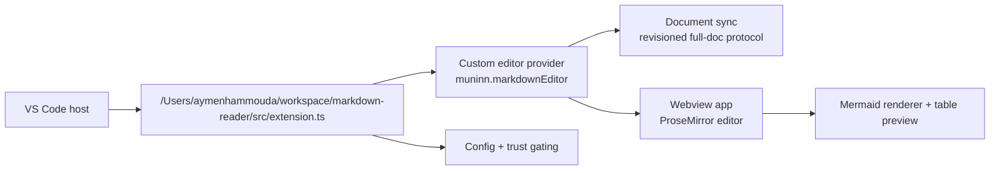

| Column 1 | Column 2 | Column 3 |
| -------- | -------- | -------- |
| Value 1  | Value 2  |          |
|          |          |          |

# Architecture

Muninn for VS Code is a desktop extension centered on a `CustomTextEditorProvider`.

## Runtime Overview

```mermaid
flowchart LR
  A["VS Code host"] --> B["/Users/aymenhammouda/workspace/markdown-reader/src/extension.ts"]
  B --> C["Custom editor provider\nmuninn.markdownEditor"]
  C --> D["Document sync\nrevisioned full-doc protocol"]
  C --> E["Webview app\nProseMirror editor"]
  E --> F["Mermaid renderer + table preview"]
  B --> G["Config + trust gating"]
```

## Modules

- `/Users/aymenhammouda/workspace/markdown-reader/src/extension.ts`
  - Activation, command registration, workspace editor-association sync.
- `/Users/aymenhammouda/workspace/markdown-reader/src/custom-editor/muninn-custom-editor-provider.ts`
  - `CustomTextEditorProvider` host, message bridge, raw-editor fallback.
- `/Users/aymenhammouda/workspace/markdown-reader/src/custom-editor/document-sync.ts`
  - Revision-aware apply path between webview and `TextDocument`.
- `/Users/aymenhammouda/workspace/markdown-reader/src/custom-editor/protocol.ts`
  - Message contracts and runtime message guards.
- `/Users/aymenhammouda/workspace/markdown-reader/src/webview/editor/index.ts`
  - Rich editor UI, command execution, preview panels.
- `/Users/aymenhammouda/workspace/markdown-reader/src/integrations/mermaid-adapter.ts`
  - Mermaid enablement and workspace-trust policy.

## Message Flow

1. Webview sends `view.ready`.
2. Host replies with `host.init` snapshot (`markdown`, `revision`, Mermaid flag).
3. Webview edits send `view.applyDocument` (debounced).
4. Host applies edit when revision matches.
5. Host emits `host.documentChanged` for authoritative state.
6. Host-triggered actions use `host.executeCommand`.

## Security Notes

- Webview CSP restricts default sources and scripts to nonce-based loading.
- Mermaid rendering runs with `securityLevel: strict`.
- Host validates inbound webview messages before processing.
- Mermaid is disabled in restricted workspaces unless explicitly allowed.
