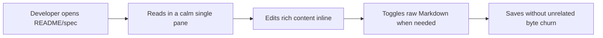

# Muninn Market Position - June 2026

This document is the source brief for the June 2026 visibility roadmap.

## Goal

Increase GitHub visibility, stars, and first installs for Muninn for VS Code by making the project easy to understand, safe to trust, and simple to try.

## Positioning

Muninn is a reading-first Markdown editor for VS Code. The core promise is:

> A WYSIWYG Markdown editor that does not churn your source.

That promise matters because Markdown users are usually not looking for a new note-taking silo. They want to stay in their repo, keep plain `.md` files, and avoid preview/edit ping-pong.

## Competitive Landscape

### Direct competitors

- `zaaack.markdown-editor`
  - Mature Marketplace presence.
  - Good search discoverability for "WYSIWYG markdown".
  - Risk to beat: users assume the category already exists and do not search deeper.
- `concretio.markdown-for-humans`
  - Strong current positioning around visual tables, images, Mermaid, and no paywall.
  - Publishes on both VS Code Marketplace and Open VSX, which matters for Cursor, Windsurf, and VSCodium users.
- Markdown Preview Enhanced / Markdown All in One / native preview
  - Strong feature depth, but preview-led rather than editor-led.

### Muninn wedge

Muninn should not fight on "most features" first. The initial wedge is trust:

- Round-trip correctness is measured and published.
- No telemetry.
- Workspace-trust behavior is explicit.
- Mermaid and webview behavior are documented.
- Source escape hatch is always available.

## Launch Strategy

1. Publish a usable alpha.
2. Publish the proof: round-trip report, security posture, and accessibility work.
3. Polish the listing: README, hero GIF, Marketplace metadata, Open VSX.
4. Engage where Markdown WYSIWYG is already being discussed.
5. Convert learning into blog posts and outreach.

## Roadmap Mapping

- Publish/install funnel: issues `#243`, `#244`, `#270`, `#277`.
- Trust proof: issues `#245`, `#260`, `#267`.
- First-run UX: issues `#246` through `#259`, `#261` through `#263`.
- Marketing/visibility: issues `#269`, `#272`, `#278`.
- Post-GA feature expansion: issues `#273` through `#276`.

## Messaging

Use plain claims that can be backed by repo evidence:

- "Single-pane Markdown editing inside VS Code."
- "Visual tables and Mermaid without leaving your repo."
- "No telemetry."
- "Round-trip behavior tested against a public corpus."
- "Built for people who read Markdown before they edit it."

Avoid vague claims like "revolutionary", "AI-native", or "the future of writing". They smell like a SaaS homepage after three espressos.

## Open Questions

- License strategy is unresolved in `main`: current repo files still say MIT. Do not implement AGPL compliance tickets until the license decision is explicit.
- The alpha should prioritize installability and proof over feature sprawl.
- Any public outreach should happen under the maintainer's real voice, not automated mass pitching.
