# Markdown Preview - Roadmap

> Open markdown files in preview mode by default, optimizing the reading experience for developers reviewing AI-generated documentation. (rolling, no fixed dates)

---

## Executive Summary

**Current State:** v0.0.0 - Pre-release development

**Core Value Proposition:**
1. **Reading-First Experience** - Markdown files open in rendered preview mode, eliminating visual noise from raw syntax
2. **Seamless Edit Mode** - Split view with text editor and live preview for efficient editing when needed
3. **Zero Configuration** - Works immediately after installation with sensible defaults

**Design Principles:** Native VS Code integration only (no custom webviews), non-intrusive design, privacy-first (no telemetry)

---

## Development Workflow: Milestone-Driven with Test Gates

This project follows a **Sprint 0-first** methodology:

1. **Sprint 0 First**: Test infrastructure + walking skeleton BEFORE any feature work
2. **Milestone Gates**: Full test suite runs at the end of each milestone step; next step BLOCKED until tests pass
3. **Latest Dependencies**: All dependencies verified at latest stable versions
4. **CI Green Required**: GitHub Actions must pass before proceeding

| Milestone | Gate Requirement |
|-----------|------------------|
| Sprint 0 Complete | CI green, walking skeleton test passes |
| Each Milestone Step Complete | Full test suite passes, coverage ≥80% |
| Release | All tests pass, no lint errors |

---

## Sprint 0 - Test Infrastructure

**Theme:** Reliable testing and CI foundation
**Task Count:** 11 tasks

#### Features

| Priority | Feature | User Story | Status |
|----------|---------|------------|--------|
| P0 | **Test & Build Infrastructure** | Setup | :white_check_mark: Complete |

#### Capabilities

- Test scaffolding (unit, integration, fixtures)
- Dependencies at latest stable versions
- CI/CD pipeline (GitHub Actions)
- Walking skeleton (extension activates)
- Coverage gates configured (80% threshold)

---

## Version Milestones

### v0.1.0 - MVP Core

**Theme:** Preview by default with edit mode toggle
**Includes:** Foundational, US1 (Preview), US2 (Edit Mode)
**Task Count:** 55 tasks

#### Features

| Priority | Feature | User Story | Status |
|----------|---------|------------|--------|
| P0 | **Core Types & Services** | Foundational | Planned |
| P0 | **Preview by Default** | US1 | Planned |
| P0 | **Edit Mode Toggle** | US2 | Planned |

#### Capabilities

- Markdown files open in rendered preview mode automatically
- "Enter Edit Mode" command opens split view (editor + live preview)
- "Exit Edit Mode" returns to preview-only mode
- Ctrl+Shift+V toggles between modes
- "Done" button in title bar for exiting edit mode
- One-time welcome message with optional US1 tutorial
- Large file handling (>1MB) with user choice
- Binary file detection and graceful handling
- Independent per-file state management
- Unsaved changes prompt on exit edit mode
- Pane tracking (move/close preview or editor)
- Focus and scroll position management
- Localization infrastructure (l10n ready)

#### Quality Gates

- All tests passing (80%+ coverage)
- No ESLint warnings
- TypeScript strict mode enabled
- JSDoc on public APIs

---

### v0.2.0 - Formatting Toolbar

**Theme:** Visual formatting tools for markdown editing
**Includes:** US3 (Formatting Toolbar)
**Task Count:** 20 tasks

#### Features

| Priority | Feature | User Story | Status |
|----------|---------|------------|--------|
| P1 | **Formatting Toolbar** | US3 | Planned |

#### Capabilities

- Bold, Italic, Strikethrough buttons in title bar
- Bullet and Numbered list formatting
- Inline code and code block formatting
- Link insertion with URL prompt
- Heading levels (H1, H2, H3)
- Smart no-selection behavior (word under cursor or placeholder)
- Toolbar visible only in edit mode
- 100% test coverage for formatting operations

---

### v0.3.0 - Access & UX

**Theme:** Multiple ways to access formatting
**Includes:** US4 (Context Menu), US5 (Keyboard Shortcuts)
**Task Count:** 20 tasks (US4: 10, US5: 9)

#### Features

| Priority | Feature | User Story | Status |
|----------|---------|------------|--------|
| P2 | **Context Menu** | US4 | Planned |
| P2 | **Keyboard Shortcuts** | US5 | Planned |

#### Capabilities

- Format submenu in right-click context menu
- Heading submenu (H1, H2, H3)
- Code submenu (Inline, Block)
- Ctrl+B for bold (edit mode only)
- Ctrl+I for italic (edit mode only)
- Configurable shortcuts for all formatting actions
- Context-scoped keybindings (no conflicts with VS Code defaults)

---

### v0.4.0 - Configuration

**Theme:** User customization options
**Includes:** US6 (Configuration)
**Task Count:** 13 tasks

#### Features

| Priority | Feature | User Story | Status |
|----------|---------|------------|--------|
| P2 | **Extension Configuration** | US6 | Planned |

#### Capabilities

- Enable/disable extension globally or per-workspace
- Exclude patterns for specific files/folders
- Max file size threshold for auto-preview
- Default excludes: `**/node_modules/**`, `**/.git/**`
- Hot-reload on configuration changes
- Context key updates on config change

---

### v1.0.0 - Stable Release

**Theme:** Production-ready release
**Includes:** Testing, Polish
**Task Count:** 24 tasks (Testing: 7, Polish: 17)

#### Features

| Priority | Feature | Description | Status |
|----------|---------|-------------|--------|
| P0 | **Test Coverage** | 80%+ overall, 100% formatting | Planned |
| P0 | **Documentation** | README, CHANGELOG, JSDoc | Planned |
| P0 | **Accessibility** | ARIA labels, keyboard nav, announcements | Planned |
| P0 | **Marketplace** | Icon, metadata, publishing | Planned |

#### Capabilities

- Full test suite with performance validation
- Edge case handling (untitled, diff views, git conflicts)
- Accessible UI with screen reader support
- State-change announcements via status bar
- Localized strings (l10n ready)
- 128x128 marketplace icon
- Error handling with Output Channel logging
- Quickstart scenario validation

---

## Feature Comparison Matrix

| Feature | v0.1 | v0.2 | v0.3 | v0.4 | v1.0 |
|---------|:----:|:----:|:----:|:----:|:----:|
| Preview by Default | :white_check_mark: | :white_check_mark: | :white_check_mark: | :white_check_mark: | :white_check_mark: |
| Edit Mode Toggle | :white_check_mark: | :white_check_mark: | :white_check_mark: | :white_check_mark: | :white_check_mark: |
| Ctrl+Shift+V Shortcut | :white_check_mark: | :white_check_mark: | :white_check_mark: | :white_check_mark: | :white_check_mark: |
| Done Button | :white_check_mark: | :white_check_mark: | :white_check_mark: | :white_check_mark: | :white_check_mark: |
| Large File Handling | :white_check_mark: | :white_check_mark: | :white_check_mark: | :white_check_mark: | :white_check_mark: |
| Formatting Toolbar | | :white_check_mark: | :white_check_mark: | :white_check_mark: | :white_check_mark: |
| Bold/Italic/Strike | | :white_check_mark: | :white_check_mark: | :white_check_mark: | :white_check_mark: |
| Lists (bullet/numbered) | | :white_check_mark: | :white_check_mark: | :white_check_mark: | :white_check_mark: |
| Code Formatting | | :white_check_mark: | :white_check_mark: | :white_check_mark: | :white_check_mark: |
| Link Insertion | | :white_check_mark: | :white_check_mark: | :white_check_mark: | :white_check_mark: |
| Headings | | :white_check_mark: | :white_check_mark: | :white_check_mark: | :white_check_mark: |
| Context Menu | | | :white_check_mark: | :white_check_mark: | :white_check_mark: |
| Ctrl+B / Ctrl+I | | | :white_check_mark: | :white_check_mark: | :white_check_mark: |
| Exclude Patterns | | | | :white_check_mark: | :white_check_mark: |
| Enable/Disable Toggle | | | | :white_check_mark: | :white_check_mark: |
| Workspace Config | | | | :white_check_mark: | :white_check_mark: |
| Full Accessibility | | | | | :white_check_mark: |
| Marketplace Ready | | | | | :white_check_mark: |

---

## Success Metrics

| Metric | MVP Target | v1.0 Target | Source |
|--------|------------|-------------|--------|
| File open time | <1s | <1s | SC-001 |
| Mode switch time | <500ms | <500ms | SC-002 |
| First-time success rate | 90% | 90% | SC-003 |
| Formatting latency | - | <100ms | SC-004 |
| Startup impact | <50ms | <50ms | SC-005 |
| User retention (survey) | - | 80%+ | SC-006 |
| Positive reviews | - | 3+ | SC-007 |
| Command collisions | 0 | 0 | SC-008 |

---

## Risk Assessment

| Risk | Probability | Impact | Mitigation |
|------|:-----------:|:------:|------------|
| VS Code preview API changes | Low | High | Use stable API commands only; monitor release notes |
| Large file performance | Medium | Medium | Skip auto-preview for >1MB; user-controlled opt-in |
| Keybinding conflicts | Medium | Low | Scope shortcuts to markdown edit mode context |
| Binary file corruption | Low | High | Detect binary content before processing; graceful fallback |
| State sync issues | Medium | Medium | Independent per-file state; clear cleanup on document close |
| Pane tracking complexity | Medium | Low | Clear state transitions; handle all pane events |

---

## Task Summary

| Step | Tasks | Notes | Gate |
|------|:-----:|-------|:----:|
| Sprint 0 | 11 | Test scaffolding, dependencies, configuration | :test_tube: CI Gate |
| v0.1.0 | 55 | Foundational + US1 + US2 | :test_tube: MVP Gate |
| v0.2.0 | 20 | US3 | :test_tube: Tests Pass |
| v0.3.0 | 20 | US4 + US5 | :test_tube: Tests Pass |
| v0.4.0 | 13 | US6 | :test_tube: Tests Pass |
| v1.0.0 | 24 | Testing + Polish | :test_tube: Release Gate |

**Total**: 143 tasks | **Parallel Opportunities**: 63 tasks | **MVP**: 66 tasks

**:warning: Milestone Gate Rule**: Next milestone step is BLOCKED until current step gate passes. No exceptions.

---

## Dependency Flow

```
Sprint 0 (11) --[TEST]--> Foundational (14)
    [CI Green]                 |
                               v
                       [TEST] Tests Pass
                               |
                               v
                       US1: Preview (17) [P0]
                               |
                               v
                       [TEST] Tests Pass
                               |
                               v
                       US2: Edit Mode (23) [P0]
                               |
                               v
                       [TEST] MVP Gate (v0.1.0)
                               |
                               v
                       US3: Toolbar (19) [P1]
                               |
                               v
                       [TEST] Tests Pass
                               |
               +---------------+---------------+
               |               |               |
               v               v               v
           US4 (10)        US5 (9)        US6 (12)
           [P2]            [P2]            [P2]
               |               |               |
               v               v               v
           [TEST]          [TEST]          [TEST]
               |               |               |
               +---------------+---------------+
                               |
                               v
                       Testing (7) + Polish (17)
                               |
                               v
                       [TEST] Release Gate (v1.0.0)
                               |
                               v
                             v1.0.0
```

**Legend**: [TEST] = Milestone Test Gate (BLOCKING)

---

## User Story Mapping

| User Story | Priority | Tasks | Version | Dependency |
|------------|:--------:|:-----:|:-------:|------------|
| US1: Preview by Default | P0 | 17 | v0.1.0 | Foundational |
| US2: Edit Mode Toggle | P0 | 23 | v0.1.0 | US1 |
| US3: Formatting Toolbar | P1 | 19 | v0.2.0 | US2 |
| US4: Context Menu | P2 | 10 | v0.3.0 | US3 |
| US5: Keyboard Shortcuts | P2 | 9 | v0.3.0 | US3 |
| US6: Configuration | P2 | 12 | v0.4.0 | Foundational |

---

## Implementation Notes

- **Sprint 0 FIRST**: Test infrastructure must be complete before any feature work
- **[P]** marks tasks that can run in parallel within their milestone step
- **MVP** = Sprint 0 + v0.1.0 Foundational + US1 + US2 (66 tasks)
- **Milestone Gates**: Each milestone step ends with test gate; next step BLOCKED if tests fail
- **README Update**: Update README.md at the end of each milestone to reflect current project state (T142, T143, T144, T145, T117)
- **CHANGELOG Update**: Update CHANGELOG.md at the end of each milestone (T142, T143, T144, T145, T118)
- **Release Closeout Tasks**: v0.1.0 (T142), v0.2.0 (T143), v0.3.0 (T144), v0.4.0 (T145), v1.0.0 (T117, T118)
- US4, US5, US6 can proceed in parallel once US3 is complete
- Testing and Polish tasks span all user stories
- Command prefix: `markdownReader.*`
- Context keys: `markdownReader.editMode`, `markdownReader.enabled`, `markdownReader.isMarkdown`

### Sprint 0 Checklist (ALWAYS FIRST)

- [x] Test scaffolding (`tests/unit/`, `tests/integration/`, `tests/fixtures/`)
- [x] Dependencies at latest stable versions (verified online)
- [x] CI/CD pipeline (`.github/workflows/ci.yml`)
- [x] Walking skeleton (extension activates, empty test passes)
- [x] Coverage gates configured (80% overall)

**Sprint 0 is complete when**: CI is green :white_check_mark:

---

*Roadmap v1.2 (rolling) - No time estimates per project constitution*
*Updated with milestone methodology and test gates*

---

Visual representations of the project roadmap for the Markdown Preview VS Code extension.

**Development Workflow**: Sprint 0 First → Milestone-Driven with Test Gates

---

## Sprint 0 + Milestone Gate Flow

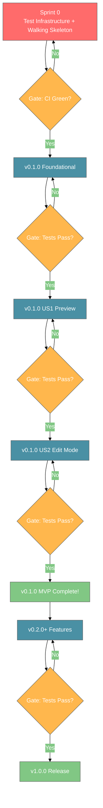

**Key**: Gate = Test Gate (BLOCKING) | Fix before proceeding if failed

---

## Timeline Evolution

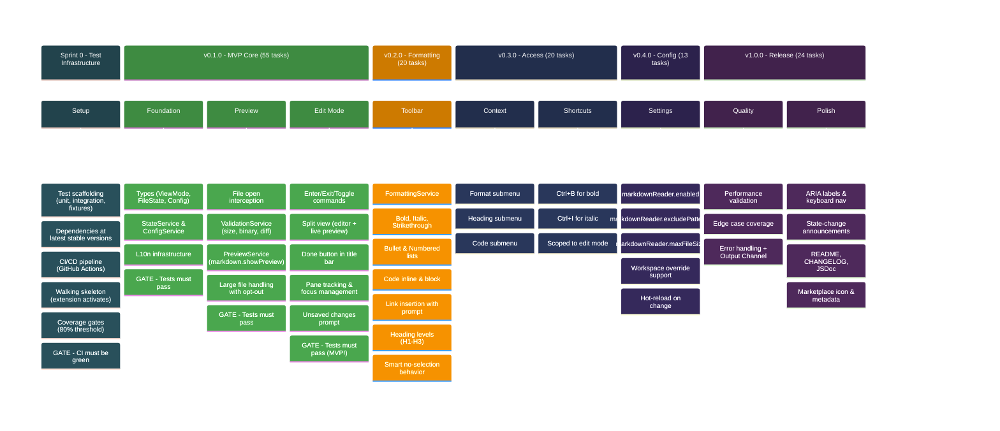

---

## Feature Dependency Graph

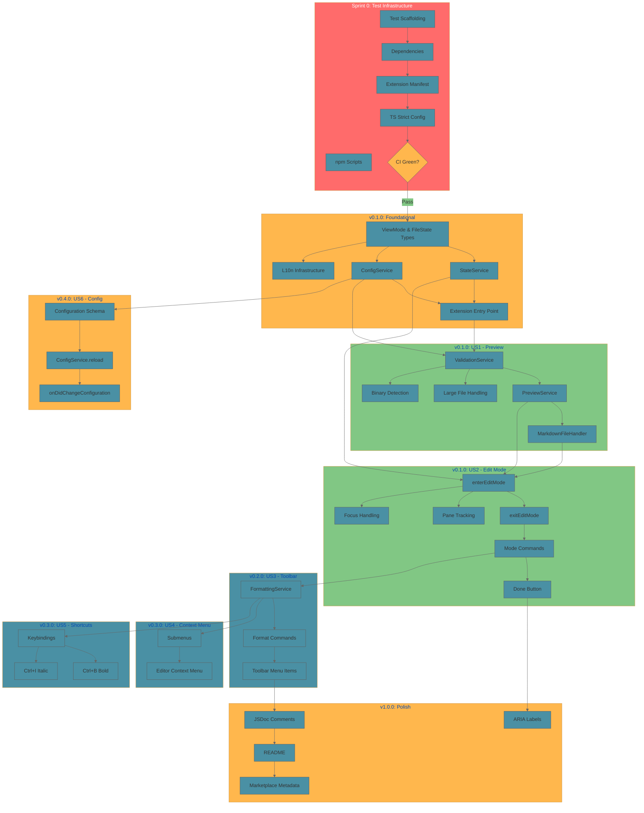

---

## Task Distribution

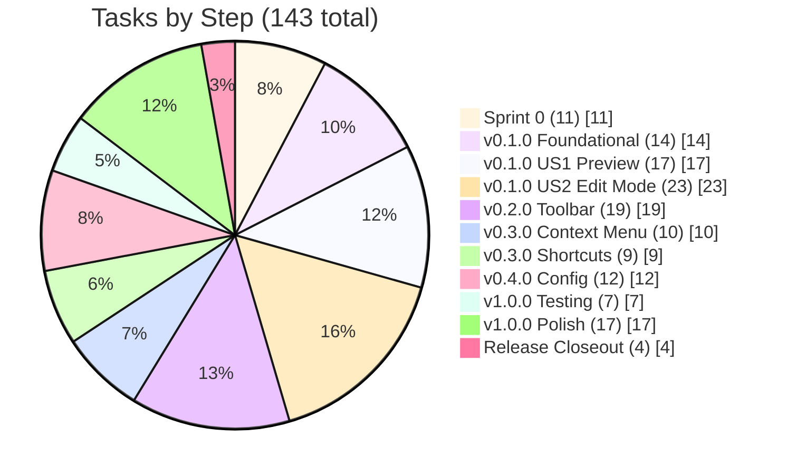

---

## MVP vs Post-MVP

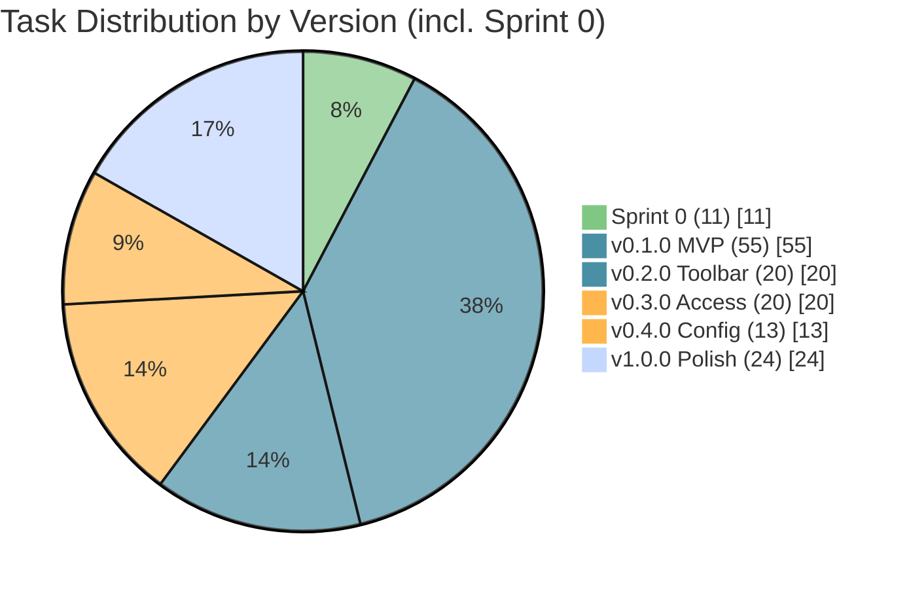

---

## User Story Dependencies

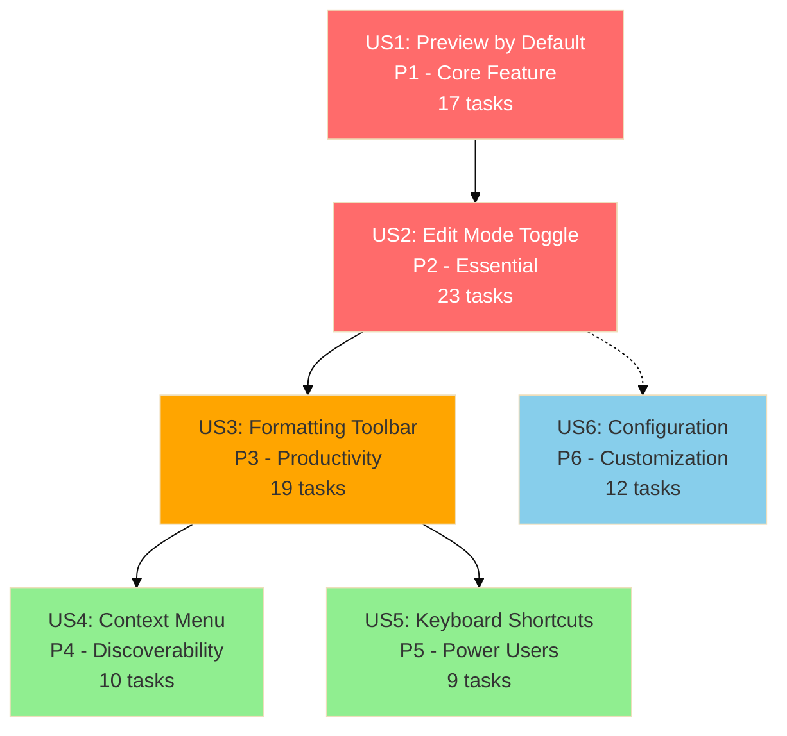

**Legend:**
- :red_circle: MVP (v0.1.0) - Must have
- :orange_circle: Core (v0.2.0) - Should have
- :green_circle: Nice (v0.3.0) - Could have
- :blue_circle: Config (v0.4.0) - Nice to have

---

## Priority/Effort Quadrant

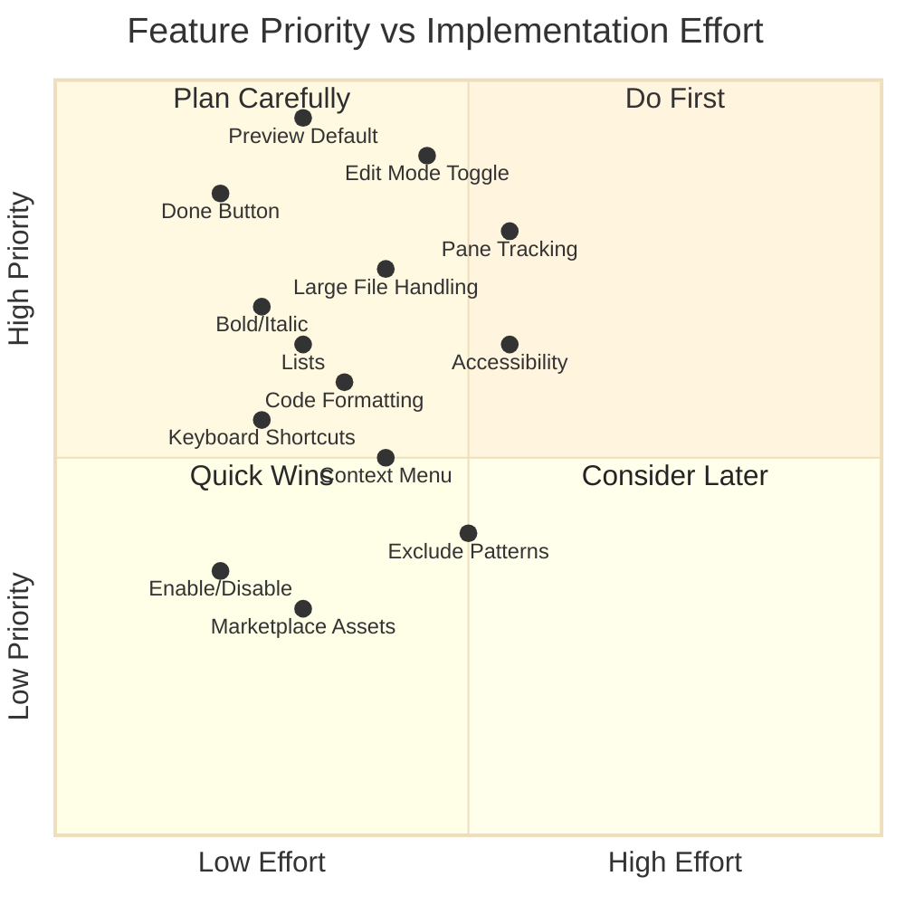

---

## User Journey

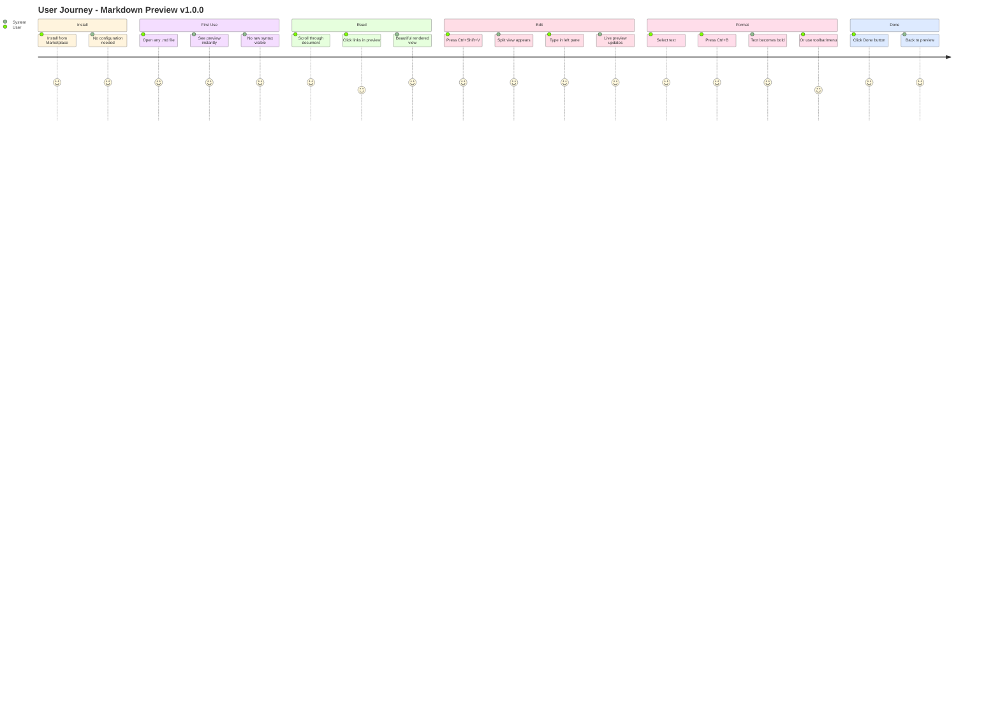

---

## File Open Flow

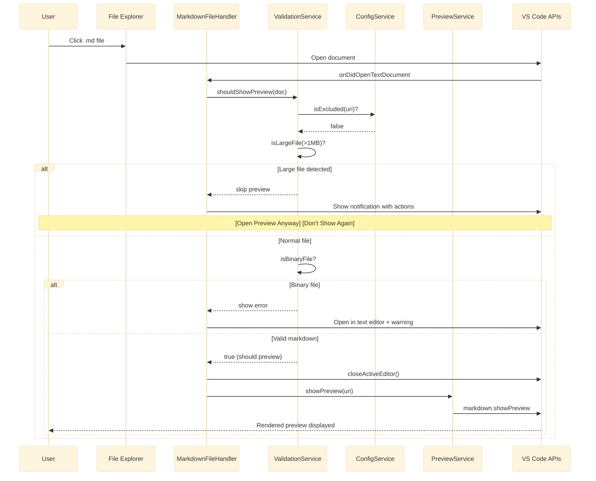

---

## Edit Mode Toggle Flow

```mermaid
%%{init: {'theme': 'base'}}%%

sequenceDiagram
    participant User
    participant Command as toggleEditMode
    participant State as StateService
    participant Preview as PreviewService
    participant VSCode as VS Code APIs

    User->>Command: Ctrl+Shift+V
    Command->>State: getMode(uri)

    alt Currently Preview Mode
        State-->>Command: ViewMode.Preview
        Command->>Preview: enterEditMode(uri)
        Preview->>VSCode: window.showTextDocument (ViewColumn.One)
        Preview->>VSCode: markdown.showPreviewToSide (ViewColumn.Two)
        Preview->>State: setMode(uri, Edit)
        State->>VSCode: setContext('markdownReader.editMode', true)
        VSCode-->>User: Split view (editor left, preview right)
        Note over User: Focus moves to text editor

    else Currently Edit Mode
        State-->>Command: ViewMode.Edit

        alt Unsaved changes & no auto-save
            Command->>VSCode: Show save prompt
            Note over User,VSCode: [Save & Exit] [Exit Without Saving] [Cancel]
        end

        Command->>Preview: exitEditMode(uri)
        Preview->>VSCode: closeActiveEditor (text editor)
        Preview->>State: setMode(uri, Preview)
        State->>VSCode: setContext('markdownReader.editMode', false)
        VSCode-->>User: Preview-only mode
        Note over User: Focus moves to preview
    end
```

---

## Architecture (v1.0.0 Target)

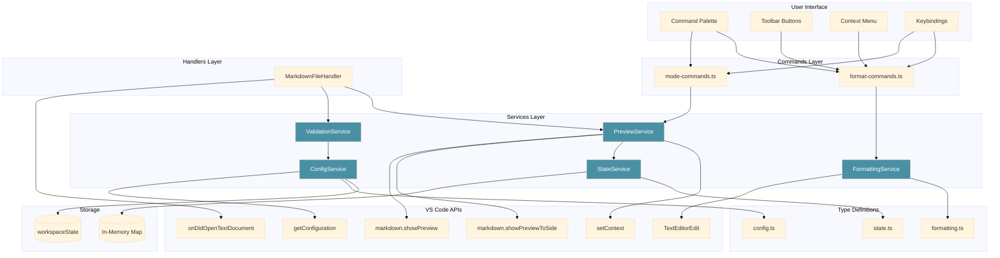

---

## Parallel Execution Opportunities

```mermaid
%%{init: {'theme': 'base'}}%%

flowchart LR
    subgraph Sprint0 ["Sprint 0: Test Infrastructure"]
        direction TB
        T001[T001: Test scaffolding]
        T002[T002: Dependencies]
        T003[T003: npm scripts]
        T004[T004: nyc config]

        subgraph parallel1 ["Can run in parallel"]
            T005[T005: ESLint]
            T006[T006: Prettier]
            T007[T007: Manifest]
            T008[T008: Source tree]
            T009[T009: tsconfig]
            T010[T010: launch.json]
            T011[T011: CI workflows]
        end
    end

    T001 --> T002 --> T003 --> T004 --> parallel1
    parallel1 --> G0{CI Green?}

    subgraph Foundational ["v0.1.0: Foundational"]
        direction TB
        subgraph parallel2a ["Types (parallel)"]
            T012[T012: state.ts]
            T013[T013: config.ts]
            T014[T014: formatting.ts]
        end

        subgraph parallel2b ["Fixtures (parallel)"]
            T018[T018: sample.md]
            T019[T019: git-conflict.md]
            T139[T139: l10n setup]
        end

        subgraph parallel2c ["Tests (parallel)"]
            T021[T021: state tests]
            T022[T022: config tests]
        end
    end

    G0 -->|Pass| parallel2a
    parallel2a --> parallel2b
    parallel2b --> parallel2c

    style Sprint0 fill:#ff6b6b,color:#fff
    style G0 fill:#FFB74D
```

---

*These diagrams are best viewed with Mermaid-compatible markdown renderers (GitHub, GitLab, VS Code with Mermaid extension).*

*Roadmap Diagrams v1.2 - Sprint 0 methodology with milestone test gates*
*Synced with tasks.md (143 tasks, 66 MVP)*
