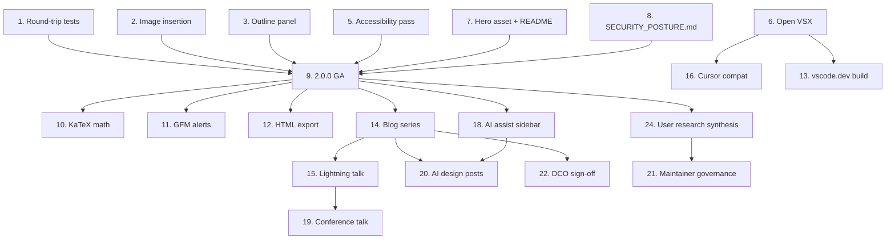

# Muninn for VS Code — Strategic Roadmap (May 2026 → Q2 2027)

> Converts the competitive brief (`docs/COMPETITIVE_BRIEF.md`) into a sequenced, scored, single‑maintainer roadmap. Supersedes the alpha‑only material in `docs/ROADMAP.md`.

**Author:** Aymen Hammouda · **Goal:** make Muninn a top‑tier VS Code extension that acts as a catalyst for personal brand · **Owner:** solo maintainer (evenings + weekends) · **Cadence:** monthly roadmap review, quarterly strategic review.

---

## 1. North‑star + supporting metrics

The roadmap optimizes for **adoption velocity** (a leading indicator of brand reach), gated by **quality** and **trust** (a leading indicator of retention and word‑of‑mouth).

| Metric                                   | Target Q3 2026 (alpha exit) | Target Q1 2027        | Target Q2 2027        |
| ---------------------------------------- | --------------------------- | --------------------- | --------------------- |
| **North star: weekly active installs**   | 2,000                       | 25,000                | 75,000                |
| Marketplace installs (cumulative)        | 5,000                       | 50,000                | 150,000               |
| Marketplace rating                       | ≥4.5★ (post‑GA)             | ≥4.6★                 | ≥4.6★                 |
| GitHub stars                             | 300                         | 1,500                 | 3,500                 |
| External contributors with merged PR     | 1                           | 10                    | 25                    |
| Independent blog/video/listicle mentions | 3                           | 10                    | 25                    |
| OpenSSF Scorecard                        | ≥7                          | ≥8                    | ≥8                    |
| CVEs                                     | 0                           | 0                     | 0                     |
| Round‑trip golden‑file pass rate         | 100% CommonMark             | 100% CommonMark + GFM | 100% + GFM extensions |

Track in `docs/METRICS.md` updated at the end of each month via the `product-management:metrics-review` skill (see §6).

---

## 2. Capacity model

Solo maintainer, ~10–15 hours/week realistic sustained, with ~25h/week spikes around release cycles. Per‑quarter capacity ≈ 130–180 hours. The 70/20/10 industry split needs to bend for a solo indie:

| Bucket                                     | Allocation | Why                                                                           |
| ------------------------------------------ | ---------- | ----------------------------------------------------------------------------- |
| Planned features                           | **55%**    | Lower than industry because solo means less ability to absorb tech debt later |
| Quality / security / tests / accessibility | **25%**    | Higher than industry — security is your wedge                                 |
| Content / marketing / community            | **15%**    | This is what compounds the personal brand                                     |
| Unplanned buffer                           | **5%**     | Bug reports, breaking changes in VS Code, dependency CVEs                     |

**Implication:** the roadmap below is intentionally conservative. If you commit to it and ship, you will have demonstrated something rare. If you triple-book like 80% of indie roadmaps do, you'll ship none of it.

---

## 3. Roadmap — Now / Next / Later with quarterly themes

### NOW · Q2 2026 (May–Aug) — Theme: **"Exit alpha credibly"**

Goal: ship `2.0.0` GA with the five claims the marketplace listing needs.

| #   | Initiative                                        |                   Reach |      Impact | Conf. | Effort (wks) |    RICE | Dependencies     |
| --- | ------------------------------------------------- | ----------------------: | ----------: | ----: | -----------: | ------: | ---------------- |
| 1   | Golden‑file round‑trip tests for CommonMark + GFM |           100% of users | 3 (massive) |   80% |            2 | **120** | none             |
| 2   | Image insertion (paste / drag / command)          |                    ~80% |    2 (high) |   90% |            3 |  **48** | none             |
| 3   | Outline panel via `DocumentSymbolProvider`        |                    ~60% |     1 (med) |  100% |            1 |  **60** | none             |
| 4   | Task list / blockquote / horizontal rule commands |                    ~50% |           1 |  100% |            1 |  **50** | none             |
| 5   | WCAG 2.1 AA accessibility pass on webview         |                    ~15% |           3 |   70% |            2 |  **31** | none             |
| 6   | Open VSX release pipeline                         |  ~10% (Cursor/VSCodium) |           2 |   90% |          0.5 |  **36** | none             |
| 7   | Hero asset (30‑sec GIF) + README rewrite          |                    100% |           2 |   90% |            1 | **180** | 1, 2, 5          |
| 8   | `docs/SECURITY_POSTURE.md` + Scorecard badge      | ~20% security‑conscious |           2 |  100% |          0.5 |  **80** | none             |
| 9   | Exit `preview: true`, ship `2.0.0` GA             |                    100% |           3 |  100% |          0.5 | **600** | 1, 2, 3, 5, 7, 8 |

Estimated effort: ~11 weeks at 60% feature allocation × ~12 weeks of calendar time → tight but feasible if scope holds.

**MoSCoW resolution if you slip:** Items 1, 5, 7, 8, 9 are **Must**. Items 2, 3 are **Should**. Items 4, 6 are **Could** — they can ship in `2.0.1`.

### NEXT · Q3 2026 (Sep–Nov) — Theme: **"Plant the flag"**

Goal: ship the differentiation features and start the content trail.

| #   | Initiative                                                                                |        Reach | Impact | Conf. | Effort (wks) |    RICE | Dependencies |
| --- | ----------------------------------------------------------------------------------------- | -----------: | -----: | ----: | -----------: | ------: | ------------ |
| 10  | KaTeX math support                                                                        |         ~40% |      2 |   90% |            2 |  **36** | 9            |
| 11  | GFM alerts / callouts (`> [!NOTE]`)                                                       |         ~60% |      2 |  100% |            1 | **120** | 9            |
| 12  | HTML export                                                                               |         ~30% |      2 |   90% |            2 |  **27** | 9            |
| 13  | vscode.dev / web extension build (best‑effort subset)                                     |         ~10% |      2 |   60% |            3 |   **4** | 6            |
| 14  | Blog post series: 4 essays (build story, ProseMirror correctness, webview trust, license) | 100% via SEO |      3 |   70% |            3 |  **70** | 9            |
| 15  | Lightning talk submission to dev community event                                          |     indirect |      2 |   50% |            1 |     tbd | 14           |
| 16  | Cursor / Windsurf compatibility tier documented                                           |         ~10% |      2 |   80% |          0.5 |  **32** | 6            |
| 17  | Listicle outreach (5–10 "best markdown VS Code" curators)                                 |     indirect |      2 |   60% |            1 |     tbd | 7, 9         |

Estimated effort: ~13 weeks. Buffer item 13 (web extension) — likely slips to Q4.

### LATER · Q4 2026 + Q1 2027 — Theme: **"Catalyze brand"**

Goal: turn the extension into a recurring story; defend the wedge against Cursor/VS Code's likely moves.

| #   | Initiative                                                                                                                                                         |            Reach | Impact | Conf. | Effort (wks) |    RICE | Dependencies           |
| --- | ------------------------------------------------------------------------------------------------------------------------------------------------------------------ | ---------------: | -----: | ----: | -----------: | ------: | ---------------------- |
| 18  | Optional AI assist sidebar — BYO API key, three commands (explain selection, summarize, mermaid‑from‑prose)                                                        |    ~30% adoption |      3 |   60% |            4 |  **14** | 9, 14                  |
| 19  | Conference talk delivered                                                                                                                                          |         indirect |      2 |   50% |            2 |     tbd | 15                     |
| 20  | Second blog series (3 posts) on AI integration design                                                                                                              |     100% via SEO |      2 |   70% |            2 |     tbd | 18                     |
| 21  | Community governance: invite 2 trusted maintainers, formalize MAINTAINERS.md                                                                                       |       bus‑factor |      3 |   80% |            1 |  **24** | external relationships |
| 22  | DCO sign‑off CLA (the MIT → Apache 2.0 half is obsolete — relicensed AGPL-3.0-only 2026-06-09, see `decisions/D-006-agpl-relicense.md`; DCO survives as issue 265) | downstream legal |      2 |  100% |          0.5 |   **8** | none                   |
| 23  | OpenAPI‑style stable extension public API for plugins (researched, not built)                                                                                      | future ecosystem |      2 |   30% |            2 |     tbd | 18                     |
| 24  | First user research synthesis from real reviews + GH issues                                                                                                        |             100% |      3 |   80% |            1 | **240** | 50k installs reached   |
| 25  | Monitor Cursor/VS Code RFCs weekly; submit patches upstream where relevant                                                                                         |  risk mitigation |      3 |   50% |       0.5/mo |     tbd | ongoing                |

**Items moved out of scope** (explicitly **Won't have** this cycle, per MoSCoW): full Notion‑style block parity, telemetry/analytics, cloud sync, PDF export pipeline (HTML covers 80%), proprietary syntax extensions, mobile companion app. Document the rejection rationale in the spec for each.

---

## 4. Dependency map (visual)

**Critical path:** items 1 → 9 → 14 → 15/18 are the spine. If item 1 slips, everything slips.

**External dependencies that need watching:**

- VS Code release cadence (monthly) — `@types/vscode` upgrades.
- ProseMirror packages (active development) — quarterly upgrade cycle.
- Mermaid 11.x → 12.x — likely lands H2 2026; budget 1 week for compat.
- VS Code Marketplace policy changes (rare but possible).
- Cursor IDE native WYSIWYG announcement (existential watch — see item 25).

---

## 5. Implementation playbook (item by item)

Each entry below: **scope · files touched · acceptance criteria · marketing motion**.

### Item 1 — Golden‑file round‑trip tests

**Scope:** A test corpus of ~80 markdown fixtures covering every CommonMark + GFM construct. For each fixture, parse → render in ProseMirror → serialize back → compare byte‑for‑byte (or with a documented normalization, such as line‑ending or trailing‑whitespace canonicalization). Failures must include the diff inline in CI output.

**Files touched:** `tests/integration-cli/round-trip/`, `tests/fixtures/markdown/`, `src/custom-editor/document-sync.ts`, `src/webview/editor/index.ts`. New script in `scripts/run-round-trip-tests.js`. Wire into `npm test`.

**Acceptance criteria:**

- 100% of CommonMark spec examples pass.
- ≥95% of GFM extensions pass; remaining ≤5% documented as known limitations with issues.
- Test report uploaded as artifact on every CI run.
- README links to the test report.

**Marketing motion:** _"The WYSIWYG that doesn't touch your bytes."_ Lead the README with the test pass rate and a link to the corpus. This is the credibility anchor for every later claim.

**Skill to use:** `product-management:write-spec` to produce a one‑page spec before coding; `engineering:testing-strategy` to design the corpus.

---

### Item 2 — Image insertion

**Scope:** Three entry points — paste image from clipboard, drag‑and‑drop onto editor, `muninn.insertImage` command. Save to configurable folder (`muninn.images.destination`, default `./images/`). Generate filename from timestamp + slugified surrounding heading. Insert markdown `` at cursor. Match VS Code native preview behavior so user expectations transfer.

**Files touched:** new `src/services/image-paste-service.ts`, new command in `src/commands/`, webview paste handler, new keybinding, settings schema update in `package.json`, `package.nls.json`.

**Acceptance criteria:**

- Paste, drag, and command flows all save the file and insert the reference.
- Works in trusted workspaces; in untrusted, shows the standard VS Code warning and proceeds with explicit consent.
- Round‑trip test (item 1) covers an image insertion fixture.
- Documented in README.

**Skill to use:** `product-management:feature-spec` for the PRD.

---

### Item 3 — Outline panel

**Scope:** Implement `DocumentSymbolProvider` that emits `SymbolKind.String` for each heading 1–6. VS Code's built‑in outline view picks it up automatically. No new UI to build.

**Files touched:** new `src/providers/document-symbol-provider.ts`, register in `src/extension.ts`.

**Acceptance criteria:**

- Outline view populates on file open.
- Clicking an outline entry moves cursor in the ProseMirror surface.
- Sticky scroll works (VS Code 1.85+ feature).
- Updates within 200ms of edit.

**Skill to use:** none required — pure execution.

---

### Item 4 — Task list / blockquote / horizontal rule commands

**Scope:** Three new commands matching the pattern of existing toggle commands. Add to toolbar advanced mode only.

**Files touched:** `src/commands/`, `src/webview/editor/index.ts`, `package.json` activation events + commands + menu items, `package.nls.json`.

**Acceptance criteria:** keyboard‑accessible, undo‑safe, round‑trip‑clean.

**Skill to use:** none required.

---

### Item 5 — WCAG 2.1 AA accessibility pass

**Scope:** Full audit of the webview surface. Specific targets:

- **Keyboard navigation:** every toolbar action reachable via Tab + Enter; arrow‑key navigation across table grid; Escape exits Mermaid block editor.
- **ARIA:** `role="toolbar"` on the toolbar with `aria-orientation="horizontal"`; `aria-label` on every icon‑only button; `role="group"` for Text/Structure/Insert sections.
- **Focus management:** visible focus ring matching VS Code theme; focus returns to caret position after toolbar action; focus trap inside the Mermaid block when its editor is open.
- **Contrast:** 4.5:1 minimum for normal text, 3:1 for large text and UI components, validated against VS Code Default Light, Default Dark+, High Contrast Light, High Contrast Dark themes.
- **Screen reader:** mode transitions (raw markdown ↔ rich) announced via `aria-live="polite"`; toolbar buttons announce active/inactive states.
- **Motion:** respect `prefers-reduced-motion` for Mermaid render transitions.

**Files touched:** `src/webview/editor/*`, theming CSS variables, possibly `assets/` for new focus styles.

**Acceptance criteria:**

- Run axe‑core CI check in CI; 0 violations at AA.
- Manual screen reader walkthrough captured as video (NVDA + VoiceOver).
- Accessibility statement published in `docs/ACCESSIBILITY.md`.
- Badge on README.

**Skill to use:** `design:accessibility-review` for the audit; `design:design-handoff` to convert findings into engineering tickets.

---

### Item 6 — Open VSX publishing pipeline

**Scope:** Add `ovsx publish` step to GitHub Actions release workflow. Configure secrets. Document fallback if marketplace and Open VSX diverge.

**Files touched:** `.github/workflows/release.yml`, `docs/RELEASE.md`.

**Acceptance criteria:** `2.0.0` GA appears on both registries on the same day.

**Skill to use:** none required.

---

### Item 7 — Hero asset + README rewrite

**Scope:** 30‑second screen capture: open a long README, watch Mermaid render inline, click into a table and edit a cell, toggle to raw markdown, toggle back. Compress to <2MB GIF. Use as the README hero.

README rewrite structure (in order of attention):

1. One‑sentence positioning: _"The honest, reading‑first markdown editor for VS Code — true WYSIWYG with byte‑perfect round‑trip, inline Mermaid, and editable tables."_
2. Hero GIF.
3. Three claim badges: round‑trip pass rate, accessibility AA, OpenSSF Scorecard.
4. Three‑line install + open instructions.
5. Feature list (groups of 3, not bullet salad).
6. Honest "what Muninn is NOT" section — sets expectations against MAIO and MPE.
7. Links to security, accessibility, roadmap docs.

**Files touched:** `README.md`, `assets/`.

**Acceptance criteria:** mobile‑rendered marketplace listing reads cleanly; first paragraph contains the positioning claim verbatim.

**Skill to use:** `brand-voice:brand-voice-enforcement` if you've established a brand voice, otherwise `product-management:stakeholder-comms` to write for the developer‑user audience.

---

### Item 8 — `docs/SECURITY_POSTURE.md` + Scorecard badge

**Scope:** Single document covering:

- Workspace trust matrix: what Muninn does vs. doesn't do in trusted/untrusted.
- Webview CSP: nonce strategy, allowed sources.
- Message bridge: validation, schema, revision protocol.
- Dependency review: Dependabot + CodeQL + secret scanning cadence.
- Disclosure process: how to report a vulnerability, response SLA.

Add OpenSSF Scorecard GitHub Action; add badge to README.

**Files touched:** `docs/SECURITY_POSTURE.md`, `.github/workflows/scorecard.yml`, `README.md`, `SECURITY.md` (cross‑link).

**Acceptance criteria:** Scorecard ≥7; security page links from marketplace listing.

**Skill to use:** `engineering:documentation`; `operations:compliance-tracking` if you want to track future SOC2/ISO posture even informally.

---

### Item 9 — Exit `preview: true`, ship `2.0.0` GA

**Scope:** flip the manifest flag, write release notes, post to socials.

**Files touched:** `package.json` (`preview` removed), `CHANGELOG.md`, `docs/RELEASE.md`.

**Acceptance criteria:** marketplace listing no longer shows the preview banner; first wave of outreach (item 17) goes out within 48 hours of GA.

**Skill to use:** `product-management:stakeholder-update` for release notes; `product-management:stakeholder-comms` for the launch‑day posts.

---

### Items 10–12 — Math, GFM alerts, HTML export

Each gets its own PRD before code. Pattern:

- **Math:** integrate KaTeX via markdown‑it‑katex; render in webview; round‑trip test fixture. Effort: 2 weeks.
- **Alerts:** add markdown‑it‑container or hand‑rolled parser for `[!NOTE]/[!WARNING]/etc.`; theme tokens for each callout type. Effort: 1 week.
- **HTML export:** `muninn.exportHtml` command, single‑file output with inlined CSS, optional Mermaid pre‑rendering to SVG. Effort: 2 weeks.

**Skill to use:** `product-management:feature-spec` (one PRD each); `product-management:write-spec` shortcut command for fast turnaround.

---

### Item 13 — vscode.dev web extension build

**Scope:** Audit which dependencies have web builds (Mermaid does, ProseMirror does). Disable features that require Node (none currently in MVP scope). Add `browser` entry in `package.json` and a `tsconfig.web.json`. Add web build to CI.

**Risk:** Mermaid bundle size in the webview may push the extension over the marketplace 50MB cap. If so, lazy‑load Mermaid on first use.

**Skill to use:** none required.

---

### Item 14 — Blog post series

Sequence the posts for compounding SEO and credibility:

1. **"Why I built Muninn"** (origin + positioning). Personal, sets the brand voice. Publish on launch day of 2.0.0.
2. **"Byte‑perfect WYSIWYG: building round‑trip safety in ProseMirror"**. Deep technical post — the engineering audience. 2 weeks after #1.
3. **"Workspace trust for VS Code webview extensions: a checklist"**. Security‑focused, references CVE‑2025‑65716 as a teaching case. 4 weeks after #1.
4. **"Why I licensed my VS Code extension AGPL — knowing the cost"**. Opinionated, license‑nerd magnet. 6 weeks after #1.

Each post: 1,200–2,500 words; one canonical illustration or diagram; SEO‑optimized title; cross‑post to dev.to + Hacker News + Lobsters + relevant subreddits.

**Skill to use:** `brand-voice:brand-voice-enforcement` per post; `product-management:stakeholder-comms` to tailor each post to its audience (devs vs. legal nerds vs. founders).

---

### Item 15 — Lightning talk submission

Target events (CFP timing matters):

- **VS Code Day** (Microsoft) — virtual, annual.
- **OSS Summit Europe / NA** — Linux Foundation.
- **Render Conference**, **dotJS**, **JSNation** — frontend ecosystem.
- **All Things Open** — accessible CFP, friendly to indie maintainers.
- Local dev meetups — the lowest‑risk first venue.

**Skill to use:** `product-management:stakeholder-comms` for the abstract; `design:design-critique` on the slide deck if you build one.

---

### Item 16 — Cursor / Windsurf compatibility tier

**Scope:** Test Muninn explicitly inside Cursor, Windsurf, VSCodium. Document any incompatibilities. Add CI matrix entry if feasible.

**Skill to use:** none required.

---

### Item 17 — Listicle outreach

**Scope:** Identify the 10 most cited "best VS Code markdown extensions" listicles. Reach out with a templated pitch: hero GIF + the three claim badges + a one‑paragraph "why list us." Track responses in a simple spreadsheet.

**Skill to use:** `sales:draft-outreach` (yes, the sales skill — it's the right tool for this even though Muninn is free).

---

### Item 18 — Optional AI assist sidebar

**Scope:** A separate webview/panel (`muninn.aiPanel`) with three commands:

1. **Explain selection** — sends selected markdown to user‑configured model.
2. **Summarize section** — same, with a different prompt.
3. **Mermaid from description** — generates a Mermaid block from prose.

Configuration is user‑provided: API key + model + endpoint. No default provider. Calls are user‑initiated (button‑click), never on selection change. Document the data flow precisely. A telemetry "no" still holds — Muninn doesn't see the requests; the user's chosen provider does.

**Files touched:** new `src/integrations/ai-bridge.ts`, new webview panel, new commands, settings, large README addition.

**Acceptance criteria:** works with at minimum OpenAI, Anthropic, and a local Ollama endpoint. Failure modes clearly surfaced. No API key persisted outside VS Code's `SecretStorage`.

**Skill to use:** `product-management:feature-spec` for a thorough PRD; `engineering:system-design` for the data‑flow document; `design:design-critique` on the sidebar UI before shipping.

---

### Items 19–25

Compressed for brevity (each gets its own PRD when its turn comes):

- **19 Conference talk:** the lightning talk graduates to a 25–30 min main‑stage. Same skills.
- **20 AI design blog series:** mirrors item 14 structure.
- **21 Maintainer governance:** identify 2 trusted contributors who have already shipped substantive PRs; offer triage rights; document review SLA.
- **22 License migration:** one PR. Update LICENSE, add NOTICE, add CONTRIBUTING.md with DCO sign‑off, update `package.json`. Announce in CHANGELOG and a short blog note. **Skill:** `operations:change-request` to document the change formally.
- **23 Public extension API (research only):** spike — write the design doc; do not build. `engineering:architecture` skill for the ADR.
- **24 User research synthesis:** scrape 6 months of marketplace reviews + GitHub issues; cluster into themes; produce an opportunity map. **Skill:** `product-management:user-research-synthesis`.
- **25 Cursor/VS Code monitoring:** GitHub watch on `microsoft/vscode` issues tagged `markdown-preview`; weekly scan of Cursor changelog; quarterly threat reassessment.

---

## 6. Which product‑management skill to use, when

The skills are tools — each is best for a specific moment in the cycle. Below is the recommended mapping; each invocation should take 15–45 minutes.

| When                               | Trigger                                                      | Skill                                                                               | Output artifact                             |
| ---------------------------------- | ------------------------------------------------------------ | ----------------------------------------------------------------------------------- | ------------------------------------------- |
| Start of each quarter              | Strategic planning kickoff                                   | `product-management:roadmap-management`                                             | Updated `docs/STRATEGIC_ROADMAP.md`         |
| Mid‑quarter                        | Need to add or kill a feature                                | `product-management:roadmap-update`                                                 | PR to roadmap doc + rationale               |
| Before any feature dev             | New initiative >1 week effort                                | `product-management:write-spec` or `product-management:feature-spec`                | One‑page PRD in `specs/<feature>/spec.md`   |
| Every 4 weeks                      | Sprint planning for next 4 weeks of work                     | `product-management:sprint-planning`                                                | Sprint plan as GitHub Project milestone     |
| Every month                        | Metrics review on the last of the month                      | `product-management:metrics-review`                                                 | Update `docs/METRICS.md`                    |
| Every release                      | Release notes ready for users                                | `product-management:stakeholder-update`                                             | CHANGELOG entry + marketplace release notes |
| Pre‑launch and pre‑post            | Blog post / launch announcement                              | `product-management:stakeholder-comms`                                              | Draft post, audience‑targeted               |
| After 6 months of issues + reviews | Quarterly user research                                      | `product-management:user-research-synthesis`                                        | `docs/research/<date>-synthesis.md`         |
| When a competitor moves            | Cursor ships WYSIWYG, MPE patches a CVE, new entrant appears | `product-management:competitive-analysis` or `product-management:competitive-brief` | Update to `docs/COMPETITIVE_BRIEF.md`       |

**Skills outside product‑management that you should reach for at the right moment:**

| Trigger                              | Skill                                 | Why                                        |
| ------------------------------------ | ------------------------------------- | ------------------------------------------ |
| Webview UX review                    | `design:design-critique`              | Catches usability issues before shipping   |
| Pre‑GA gate                          | `design:accessibility-review`         | WCAG AA evidence for the marketplace claim |
| Designing toolbar / sidebar          | `design:ux-writing`                   | Microcopy on tooltips and empty states     |
| Convert designs to engineering tasks | `design:design-handoff`               | Reduces back‑and‑forth                     |
| Test corpus design                   | `engineering:testing-strategy`        | Round‑trip and accessibility CI            |
| Each release                         | `engineering:deploy-checklist`        | Pre‑flight before ovsx + vsce publish      |
| Security posture doc                 | `engineering:documentation`           | Structure SECURITY_POSTURE.md              |
| Public API spike                     | `engineering:architecture`            | ADR for the extension API design           |
| License migration                    | `operations:change-request`           | Document the change formally               |
| Scorecard / future audits            | `operations:compliance-tracking`      | Track posture longitudinally               |
| Listicle / curator outreach          | `sales:draft-outreach`                | Templated, polite, specific                |
| Blog series / launch posts           | `brand-voice:brand-voice-enforcement` | Consistent voice once defined              |

**Skill orchestration template for a new feature**, in order:

1. `product-management:feature-spec` — PRD.
2. `engineering:system-design` (for non‑trivial features) — architecture.
3. `design:design-critique` — UX feedback on mockup.
4. `engineering:testing-strategy` — test plan.
5. **Build the feature** (no skill — execution).
6. `design:accessibility-review` — pre‑merge accessibility check.
7. `engineering:code-review` — self‑review or peer review.
8. `engineering:deploy-checklist` — release gate.
9. `product-management:stakeholder-update` — CHANGELOG + release note.
10. `product-management:stakeholder-comms` — blog/social post.

---

## 7. Cadence and review loops

| Cadence             | What                                                                                       | Output                                                   |
| ------------------- | ------------------------------------------------------------------------------------------ | -------------------------------------------------------- |
| Weekly (Sunday eve) | Personal 30‑min check‑in: what shipped, what's blocked, what's the one thing for next week | Plain‑text note in `notes/weekly/`                       |
| Monthly (last Sun)  | Metrics review + roadmap adjustments                                                       | Updated METRICS.md + roadmap if needed                   |
| Quarterly           | Strategic review: did the theme play out? what changed in the competitive landscape?       | Full roadmap refresh; new competitive scan               |
| Per release         | Postmortem on the release itself — what went well, what dragged                            | Short note in `docs/postmortems/`                        |
| Per CVE in category | Threat reassessment                                                                        | Security posture update; possibly accelerated patch ship |

---

## 8. What "done" looks like in 12 months

By **May 2027**, success means:

- Muninn is in the top 5 results for "VS Code WYSIWYG markdown" on the marketplace.
- ≥3 independent listicles place it in their top 3.
- ≥1 conference talk delivered.
- 4+ blog posts ranking on first page of Google for their target queries.
- 50k+ installs, ≥4.5★ rating, ≥10 external contributors.
- A public security posture page with zero CVEs.
- A documented, opinionated stance on what Muninn is _not_ (no telemetry, no proprietary syntax, no cloud; licensed AGPL-3.0-only).
- The personal brand "Aymen who built Muninn" returns clean Google results.

If Cursor or VS Code ships a built‑in single‑pane WYSIWYG before then, Muninn's defense is _the trust + correctness + Mermaid + table grid combination_, plus the demonstrated capacity to ship — which is itself the brand asset.

---

## 9. Decision log (start now)

Maintain a short decision log under `docs/decisions/` using ADR‑style records. Pre‑seed with:

1. **D‑001 · Stay MIT (rejected AGPL).** Rationale: see `COMPETITIVE_BRIEF.md` §7. **Superseded by D‑006 (2026-06-09): relicensed AGPL-3.0-only — see `decisions/D-006-agpl-relicense.md` and `MARKET_POSITION_2026-06.md` §7.**
2. **D‑002 · ProseMirror as editor engine.** Rationale: byte‑perfect round‑trip + workspace‑trust composability.
3. **D‑003 · No telemetry, ever.** Rationale: positioning wedge + trust.
4. **D‑004 · CommonMark + GFM only — no proprietary syntax.** Rationale: avoid Obsidian/Notion lock‑in trap.
5. **D‑005 · One PRD before any >1‑week feature.** Rationale: forcing function against scope creep.

Each future significant decision adds an ADR. This is itself a personal‑brand asset over time — public ADRs signal seriousness to senior engineers.

---

## Appendix · Mapping to existing project docs

| New / updated doc                       | Replaces / extends                                              |
| --------------------------------------- | --------------------------------------------------------------- |
| `docs/STRATEGIC_ROADMAP.md` (this file) | Extends `docs/ROADMAP.md` (which stays as alpha‑exit reference) |
| `docs/COMPETITIVE_BRIEF.md`             | New                                                             |
| `docs/METRICS.md`                       | New                                                             |
| `docs/SECURITY_POSTURE.md`              | New (planned in Q2)                                             |
| `docs/ACCESSIBILITY.md`                 | New (planned in Q2)                                             |
| `docs/decisions/D-*.md`                 | New                                                             |
| `docs/postmortems/`                     | New                                                             |
| `specs/<feature>/spec.md`               | Continues current SpecKit pattern                               |
