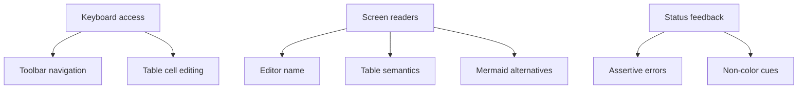

# Accessibility Audit - June 2026

This audit records the accessibility issues behind the June 2026 roadmap. It is scoped to WCAG 2.1 AA expectations for the Muninn custom editor webview.

## Summary

The editor is usable for pointer-driven workflows, but several keyboard and screen-reader paths need hardening before a credible public alpha.

## Findings

### 1. Toolbar uses `role="toolbar"` without the ARIA toolbar keyboard model

- Severity: P1
- Roadmap issue: `#246`
- Current risk: every toolbar button is a tab stop, so keyboard users must tab through the full toolbar before reaching the document.
- Expected behavior: one toolbar tab stop, arrow-key navigation inside the toolbar, Home/End support, and focus restricted to visible controls.

### 2. Mermaid output has weak screen-reader semantics

- Severity: P1
- Roadmap issue: `#247`
- Current risk: rendered diagrams can be visually useful while being mostly invisible or unnamed to assistive technology.
- Expected behavior: rendered diagram containers need accessible names, text alternatives where practical, and announced show/hide state changes.

### 3. Table node view lacks complete table semantics

- Severity: P1
- Roadmap issue: `#248`
- Current risk: editable tables are hard to distinguish when multiple tables exist and header relationships are not explicit enough.
- Expected behavior: header cells use `scope="col"` and each editable table has a useful accessible name.

### 4. Table keyboard editing drops focus

- Severity: P1
- Roadmap issue: `#249`
- Current risk: pressing Enter commits by blurring the input, leaving keyboard users without a stable place in the table.
- Expected behavior: spreadsheet-like flow with Enter committing and moving down, Escape reverting, arrow-key cell navigation, and focus preservation after DOM rebuilds.

### 5. ProseMirror editor surface has no accessible name

- Severity: P2
- Roadmap issue: `#251`
- Current risk: screen-reader users land on an unlabeled contenteditable region.
- Expected behavior: the actual contenteditable element has a localized label, `role="textbox"`, and `aria-multiline="true"`.

### 6. Errors and statuses share one polite channel

- Severity: P2
- Roadmap issue: `#252`
- Current risk: failures can be announced too softly or look like normal statuses. Some table feedback relies on color only.
- Expected behavior: errors use an assertive alert channel with explicit "Error" language and non-color cues.

### 7. Manual screen-reader verification is still required

- Severity: P1
- Roadmap issue: `#260`
- Current risk: automated checks cannot prove the editor feels coherent in VoiceOver and NVDA.
- Expected behavior: run a manual pass after issues `#246` through `#252` land.

## Acceptance Bar

Muninn should not claim accessibility maturity until the P1 items are fixed and manually verified with at least:

- VoiceOver on macOS.
- NVDA on Windows.
- Keyboard-only smoke flow: open file, use toolbar, edit a table, toggle source, inspect Mermaid output.
