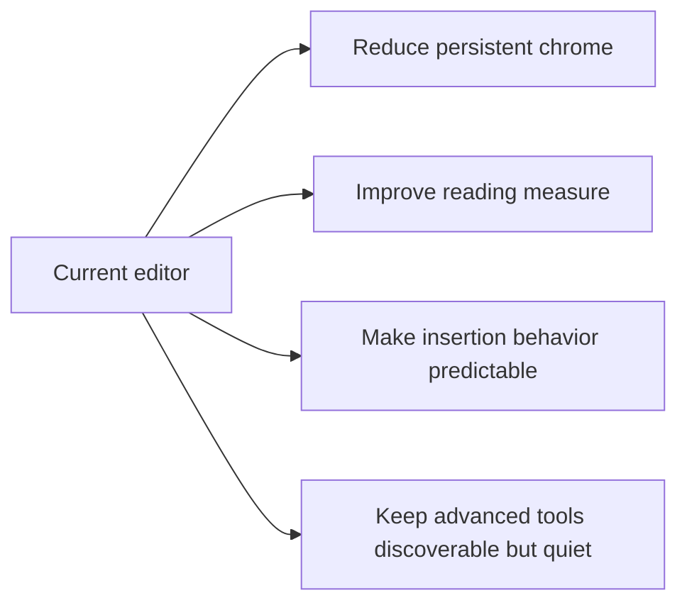

# Design Critique - June 2026

This critique supports the June 2026 roadmap. It focuses on whether Muninn feels like a reading-first Markdown editor rather than a busy web app inside VS Code.

## Product Principle

Chrome should earn its pixels. The document is the product.

## Findings

### 1. Text measure is too wide on large monitors

- Severity: P1
- Roadmap issue: `#253`
- Problem: paragraphs can stretch across the full editor width, which weakens the reading-first promise.
- Recommendation: default to a centered content column around 70ch, with a setting for users who prefer full width.

### 2. Basic toolbar hides common Markdown actions

- Severity: P2
- Roadmap issue: `#254`
- Problem: list buttons are hidden behind "More" even though bullet and numbered lists are core Markdown operations.
- Recommendation: keep Bold, Italic, Link, H1, H2, Bullet list, Numbered list, Table, and Source in the basic tier.

### 3. Mermaid has two preview models

- Severity: P2
- Roadmap issue: `#255`
- Problem: a global preview panel and per-block preview can show duplicated or mismatched diagrams.
- Recommendation: use per-block previews only. They are spatially honest and easier to reason about.

### 4. Block insertion can destroy selected text

- Severity: P2
- Roadmap issue: `#256`
- Problem: inserting a table, code block, or Mermaid block with text selected replaces content unexpectedly.
- Recommendation: insert after the current top-level block except when replacing an empty paragraph.

### 5. Cancelled link input leaves a stale status

- Severity: P3
- Roadmap issue: `#257`
- Problem: dismissing host input can leave the status line stuck on "Awaiting link input".
- Recommendation: send an explicit cancellation message and restore focus/status.

### 6. Brand header competes with document content

- Severity: P2
- Roadmap issue: `#258`
- Problem: the persistent header repeats identity that the tab and listing already provide.
- Recommendation: fold identity into the status line and reclaim vertical space.

### 7. Small polish items should be batched

- Severity: P3
- Roadmap issue: `#259`
- Problem: dead CSS, mixed active-state mechanics, fixed font-size, and missing hidden heading are too small for separate roadmap tickets.
- Recommendation: keep them bundled.

## Non-Goals

- Do not turn the editor into a landing page.
- Do not add decorative panels around the document.
- Do not chase Notion-style block editor parity before installability and trust proof.
