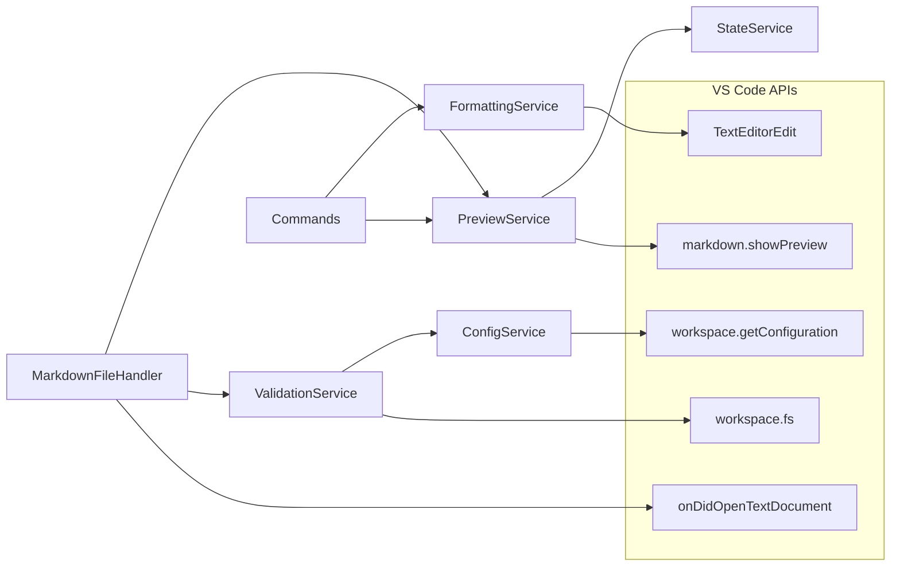
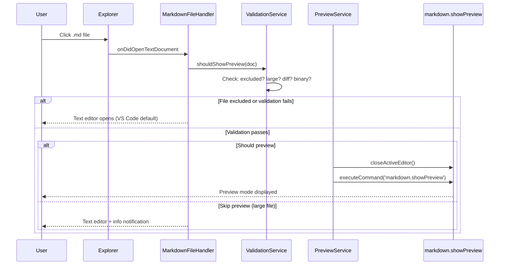
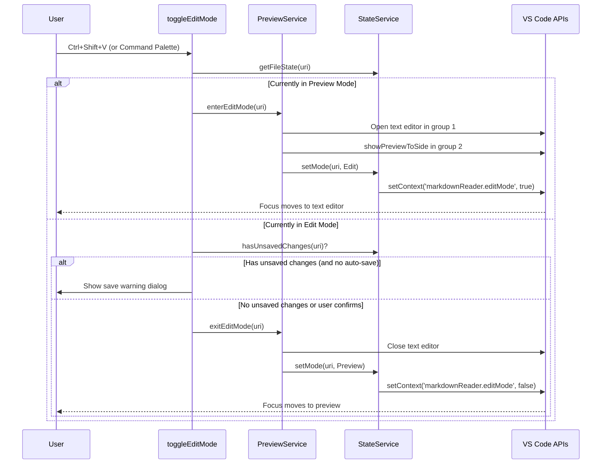

# Feature Specification: Markdown Preview Default

**Feature Branch**: `feature/markdown-preview`
**Created**: 2025-12-23
**Status**: Draft
**Input**: VS Code extension that opens markdown files in preview mode by default with edit mode toggle and formatting toolbar

## User Scenarios & Testing *(mandatory)*

### User Story 1 - Preview Markdown by Default (Priority: P0)

As a developer reviewing AI-generated documentation, I want markdown files to open in rendered preview mode by default, so I can read the content without seeing raw markdown syntax.

**Why this priority**: This is the core value proposition. Without this, the extension has no reason to exist. Every other feature depends on this foundational behavior.

**Independent Test**: Install extension, click any .md file in the file explorer, verify it opens in preview mode instead of raw editor.

**Acceptance Scenarios**:

1. **Given** a markdown file exists in the workspace, **When** user clicks the file in the explorer, **Then** the file opens in rendered preview mode (not raw markdown)
2. **Given** user opens a markdown file via Quick Open (Ctrl+P), **When** they select the file, **Then** it opens in preview mode
3. **Given** user navigates to a markdown file via "Go to Definition" or similar, **When** the file opens, **Then** it displays in preview mode
4. **Given** the extension is disabled globally, **When** user opens a markdown file, **Then** VS Code's default behavior applies (raw editor)
5. **Given** the extension is installed for the first time, **When** the user opens their first markdown file, **Then** show a non-blocking welcome message with an optional US1 tutorial link, and do not show it again after dismissal

---

### User Story 2 - Switch to Edit Mode (Priority: P0)

As a developer who needs to make changes to a markdown file, I want a clear, non-intrusive way (Command Palette or keyboard shortcut) to switch to edit mode with a split view showing both raw markdown and live preview, so I can edit efficiently while seeing the rendered result.

**Why this priority**: Users must be able to edit files. Without edit mode, the extension would make markdown files read-only, which is unacceptable.

**Independent Test**: Open markdown preview, run "Markdown Reader: Enter Edit Mode" from Command Palette (or Ctrl+Shift+V), verify split view appears with editor and live preview.

**Acceptance Scenarios**:

1. **Given** a markdown file is open in preview mode, **When** the user runs "Markdown Reader: Enter Edit Mode" from the Command Palette, **Then** the view splits with text editor and live preview
2. **Given** a markdown file is open in preview mode, **When** the user presses Ctrl+Shift+V, **Then** the view splits with text editor and live preview
3. **Given** the user is in edit mode, **When** they press Ctrl+Shift+V or click the "Exit Edit Mode" button in the editor title bar, **Then** the text editor closes and only preview remains
4. **Given** the user manually opens the text editor (via VS Code command), **When** they are editing, **Then** the system respects this and stays in edit mode

---

### User Story 3 - Format Text with Toolbar (Priority: P1)

As a developer editing markdown, I want a formatting toolbar with common actions (bold, italic, lists, etc.) visible when in edit mode, so I can format text without memorizing markdown syntax.

**Why this priority**: Formatting toolbar enhances productivity but is not essential. Users familiar with markdown can work without it.

**Independent Test**: Enter edit mode, verify toolbar icons appear in title bar, click bold icon with text selected, verify text is wrapped with asterisks.

**Acceptance Scenarios**:

1. **Given** user is in edit mode with text selected, **When** they click the Bold button, **Then** the selection is wrapped with `**`
2. **Given** user is in edit mode with text selected, **When** they click the Italic button, **Then** the selection is wrapped with `_`
3. **Given** user is in edit mode with cursor on a line, **When** they click Bullet List button, **Then** `- ` is toggled at the line start
4. **Given** user is in edit mode with no selection, **When** they click Bold button, **Then** the word under cursor is wrapped (or placeholder inserted if no word)
5. **Given** user is in preview-only mode, **When** they look at the title bar, **Then** formatting buttons are not visible

---

### User Story 4 - Format Text with Context Menu (Priority: P2)

As a developer editing markdown, I want a right-click context menu with formatting options, so I can discover and access formatting features without looking for toolbar icons.

**Why this priority**: Context menu provides discoverability and alternative access. It's a convenience feature, not core functionality.

**Independent Test**: Enter edit mode, right-click in editor, verify "Format" submenu appears with all formatting options.

**Acceptance Scenarios**:

1. **Given** user is in edit mode with text selected, **When** they right-click and select Format > Bold, **Then** the selection is wrapped with `**`
2. **Given** user is in edit mode, **When** they right-click and navigate to Format > Heading, **Then** a submenu shows H1, H2, H3 options
3. **Given** user is in edit mode, **When** they right-click and navigate to Format > Code, **Then** a submenu shows Inline and Block options
4. **Given** user is in preview-only mode, **When** they right-click, **Then** the Format submenu is not shown

---

### User Story 5 - Use Keyboard Shortcuts (Priority: P2)

As a power user editing markdown, I want keyboard shortcuts for all formatting actions and mode switching, so I can work efficiently without using the mouse.

**Why this priority**: Keyboard shortcuts are a power-user feature. The extension works without them, just less efficiently.

**Independent Test**: Enter edit mode, select text, press Ctrl+B, verify text becomes bold.

**Acceptance Scenarios**:

1. **Given** user is in edit mode with text selected, **When** they press Ctrl+B, **Then** text becomes bold
2. **Given** user is in edit mode with text selected, **When** they press Ctrl+I, **Then** text becomes italic
3. **Given** user wants toggle behavior, **When** they press Ctrl+Shift+V, **Then** follow User Story 2 acceptance criteria

---

### User Story 6 - Configure Extension Behavior (Priority: P2)

As a user with specific workflow needs, I want to configure which files/folders are excluded from auto-preview and enable/disable the extension entirely, so the extension doesn't interfere with my existing workflow.

**Why this priority**: Configuration is important for adoption but not required for core functionality. Sensible defaults should work for most users.

**Independent Test**: Open settings, set exclude pattern for "node_modules", open markdown file in node_modules, verify it opens in text editor mode.

**Acceptance Scenarios**:

1. **Given** user has configured exclude patterns including `**/node_modules/**`, **When** they open a markdown file inside node_modules, **Then** it opens in standard VS Code mode (text editor)
2. **Given** user has disabled the extension globally in settings, **When** they open any markdown file, **Then** VS Code's default behavior applies
3. **Given** user has disabled the extension for the current workspace, **When** they open a markdown file, **Then** VS Code's default behavior applies for that workspace only

---

### Edge Cases

- **New untitled markdown files**: Open in edit mode (no content to preview yet)
- **Diff views**: Do not intercept; let VS Code handle normally
- **Large files (>1MB)**: Skip auto-preview, open in text editor with info message and link to manually trigger preview
- **Files opened via terminal commands**: Apply same preview-by-default behavior
- **User manually switches to text editor**: Respect the user's choice; stay in edit mode until Exit Edit Mode is clicked
- **Multiple markdown files open**: Each file maintains its own edit/preview state independently
- **File changes on disk while in preview**: VS Code's native markdown preview auto-refreshes when the underlying file changes on disk; no extension action required
- **Git conflict markers in file**: Show in edit mode to allow resolution
- **Binary files with .md extension**: Handle gracefully (show error or raw content)

## Requirements *(mandatory)*

**Note on IDs**: Requirement IDs are stable identifiers and are not guaranteed to be sequential.

### Functional Requirements

**Preview Mode (Core)**

- **FR-001**: Extension MUST intercept markdown file opens and display rendered preview instead of text editor
- **FR-002**: Preview MUST use VS Code's native markdown preview (no custom webview renderer)
- **FR-003**: Preview mode MUST have zero visible UI additions within the preview editor itself (no custom UI/overlays/webviews). Transient status bar announcements (e.g., `vscode.window.setStatusBarMessage`) are allowed for accessibility.
- **FR-004**: Extension MUST work immediately after installation with no configuration required
**Edit Mode**

- **FR-005**: Extension MUST provide an "Enter Edit Mode" command in the Command Palette (and via keybinding) that works while a markdown preview is focused
- **FR-006**: Edit mode MUST display split view with text editor (left) and live preview (right) in separate editor groups; default is side-by-side horizontal layout
- **FR-006a**: If user moves preview pane: State persists; extension tracks both panes
- **FR-006b**: If user closes preview pane manually: Treat as "editor only" (still edit mode, toolbar visible)
- **FR-006c**: If user closes text editor pane: Exit edit mode; show preview only
- **FR-006d**: Default split ratio SHOULD be 50/50 when supported; user can resize freely
- **FR-006e**: SHOULD respect VS Code's `workbench.editor.splitInGroupLayout` setting when supported
- **FR-006g**: Support is determined by availability of VS Code editor group layout APIs at runtime. If not available, the extension MUST default to standard split behavior and document the limitation in README.md.
- **FR-006f**: If the user explicitly opens the text editor for a markdown file, the extension MUST respect the choice and stay in edit mode until the user exits edit mode
- **FR-007**: Preview in edit mode MUST update automatically as user types using VS Code's native live preview (no manual refresh required)
- **FR-008**: Extension MUST provide an "Exit Edit Mode" button (icon: `$(eye)`) in the text editor title bar (edit mode only) to return to preview-only mode. Tooltip: "Return to preview mode (Ctrl+Shift+V)"
- **FR-009**: Extension MUST NOT auto-return to preview mode when file is saved

**Formatting Toolbar**

- **FR-010**: Toolbar icons MUST only be visible when in edit mode AND file is markdown
- **FR-011**: Extension MUST provide Bold, Italic, Strikethrough formatting buttons
- **FR-012**: Extension MUST provide Bullet List and Numbered List buttons
- **FR-013**: Extension MUST provide Code (inline/block) button
- **FR-014**: Extension MUST provide Link button that prompts for URL
- **FR-015**: Extension MUST provide Heading button

**Formatting Behavior**

- **FR-016**: Bold MUST wrap selection with `**` markers
- **FR-017**: Italic MUST wrap selection with `_` markers
- **FR-018**: Strikethrough MUST wrap selection with `~~` markers
- **FR-019**: Bullet list MUST toggle `- ` at line start
- **FR-020**: Numbered list MUST toggle `1. ` at line start
- **FR-021**: Code inline MUST wrap selection with backtick markers
- **FR-022**: Code block MUST wrap selection with triple backtick markers
- **FR-023**: Link MUST prompt for URL and wrap as `[text](url)`
- **FR-024**: Heading MUST allow specific level selection (H1, H2, H3) via context submenu
- **FR-025**: When no text is selected, formatting MUST apply to the word under cursor if one exists; otherwise insert placeholder:

| Format | No Selection Behavior | Placeholder Text |
|--------|----------------------|------------------|
| Bold | Wrap word under cursor | Insert `**bold text**` (placeholder selected) |
| Italic | Wrap word under cursor | Insert `_italic text_` (placeholder selected) |
| Strikethrough | Wrap word under cursor | Insert `~~strikethrough~~` (placeholder selected) |
| Code Inline | Wrap word under cursor | Insert `` `code` `` (placeholder selected) |
| Code Block | Wrap current line | Insert triple backticks with `code` placeholder |
| Link | Wrap word under cursor | Insert `[text](url)` with "url" selected for easy replacement |
| Bullet List | Toggle `- ` at current line start | Toggle prefix (no placeholder needed) |
| Numbered List | Toggle `1. ` at current line start | Toggle prefix (no placeholder needed) |
| Heading | Prepend `# ` to current line | Prepend prefix (no placeholder needed) |

"Word under cursor" uses VS Code's word selection behavior (expand to word boundaries)

**Cursor Behavior After Insertion**: When a placeholder is inserted (no word under cursor), the placeholder text is automatically selected so the user can immediately type to replace it. Example: inserting `**bold text**` leaves "bold text" selected.

**Context Menu**

- **FR-026**: Extension MUST add "Format" submenu to editor context menu in edit mode
- **FR-027**: Format submenu MUST include all formatting options with text labels
- **FR-028**: Heading option MUST have submenu with H1, H2, H3 levels
- **FR-029**: Code option MUST have submenu with Inline and Block options
- **FR-030**: Format submenu MUST NOT appear when in preview-only mode

**Keyboard Shortcuts**

- **FR-031**: Extension MUST provide Ctrl+Shift+V (Cmd+Shift+V on Mac) to toggle between preview and edit mode
- **FR-031a**: Toggle works from preview and editor panes, respecting edit mode state
- **FR-032**: Extension MUST provide Ctrl+B (Cmd+B on Mac) for bold, scoped to markdown edit mode only (does not override VS Code defaults in other contexts)
- **FR-033**: Extension MUST provide Ctrl+I (Cmd+I on Mac) for italic, scoped to markdown edit mode only (does not override VS Code defaults in other contexts)
- **FR-034**: All formatting actions MUST have configurable keyboard shortcuts; only Ctrl+B (bold) and Ctrl+I (italic) have default bindings which use `when` clause to restrict to markdown edit context

**Configuration**

- **FR-035**: Extension MUST provide setting to exclude files/folders from auto-preview (glob patterns)
- **FR-036**: Extension MUST provide setting to enable/disable extension globally
- **FR-037**: Extension MUST support workspace-level configuration override
- **FR-038**: Default exclude patterns MUST include common non-documentation paths (node_modules, .git)

**Edge Case Handling**

- **FR-039**: New untitled markdown files MUST open in edit mode
- **FR-040**: Diff views MUST NOT be intercepted by the extension
- **FR-041**: Files larger than 1MB MUST skip auto-preview and open in text editor with enhanced UX:
  - Show info notification (not modal): "Large file detected (X.X MB). Preview may be slow."
  - Notification includes: [Open Preview Anyway] [Don't Show Again for This File]
  - User's choice per-file is stored in workspaceState
  - If user selects "Don't Show Again for This File", future opens skip the prompt and open in text editor; user can still manually open preview
  - If user clicks "Open Preview Anyway", open in preview mode
- **FR-042**: Each open file MUST maintain independent edit/preview state
- **FR-043**: Extension MUST include marketplace metadata: 128x128 PNG icon, display name "Markdown Reader", description, categories (["Other"]), keywords (5+), repository URL, license (MIT), and CHANGELOG.md link. The CHANGELOG.md link MUST be provided via the repository field in package.json and referenced in README.md under a "Changelog" section.
- **FR-045**: When user attempts to exit edit mode with unsaved changes:
  - If VS Code's "Auto Save" is enabled: Proceed (file is auto-saved)
  - If "Auto Save" is off AND file has unsaved changes: Show warning dialog:
    "You have unsaved changes. Save before exiting edit mode?"
    [Save & Exit] [Exit Without Saving] [Cancel]

**Error Handling**

- **FR-046**: If preview fails to load, show error notification with "Open in Editor" button
- **FR-047**: If file is deleted externally while in preview, let VS Code handle; extension cleans up state
- **FR-048**: If file has binary content despite .md extension, show error: "Cannot preview binary file" and open in text editor
- **FR-049**: Extension conflicts are logged to Output Channel "Markdown Reader"; no silent failures

**Keyboard Navigation (Accessibility)**

- **FR-050**: Keyboard navigation flow in edit mode:

| Context | Key | Action |
|---------|-----|--------|
| Preview pane | Ctrl+Shift+V | Enter edit mode; focus moves to text editor |
| Text editor | Tab | Move focus to first toolbar button |
| Toolbar button | Tab | Move to next toolbar button |
| Toolbar button | Shift+Tab | Move to previous toolbar button |
| Toolbar button | Enter/Space | Activate button |
| Toolbar (any button) | Escape | Return focus to text editor |
| Text editor | Ctrl+Shift+V | Exit edit mode; focus moves to preview |

- **FR-051**: After mode switch, focus position:
  - Enter edit mode: Focus on text editor at line 1, column 1 (or last cursor position if returning)
  - Exit edit mode: Focus on preview pane; preserve scroll position when feasible (otherwise rely on native preview behavior)

  **Clarification**: "Returning" means re-entering edit mode for a file that was previously in edit mode during the current VS Code session. The extension tracks the last cursor position per-file in memory (not persisted across restarts).

- **FR-052 (Accessibility - Announcements)**: All mode/state changes MUST be announced using transient status bar messages (screen-reader friendly), and all user-facing strings MUST be localized via `vscode.l10n`.

### Non-Functional Requirements

- **NFR-001 (Privacy)**: Extension MUST NOT collect telemetry or send any data externally
- **NFR-002 (Performance - Startup)**: Extension MUST add less than 50ms to VS Code startup time (SC-005)
- **NFR-003 (Performance - Mode Switch)**: Mode switching MUST complete in under 500ms (SC-002)
- **NFR-004 (Performance - Formatting)**: Formatting operations MUST complete in under 100ms (SC-004)
- **NFR-005 (Quality - Type Safety)**: TypeScript strict mode MUST be enabled; `any` MUST NOT be used without documented justification
- **NFR-006 (Quality - Naming)**: Source files MUST follow kebab-case naming convention (per constitution)
- **NFR-007 (Testing)**: Unit + integration tests MUST exist; overall code coverage MUST be at least 80%; formatting operations MUST have 100% coverage
- **NFR-008 (Documentation)**: Every public function MUST have JSDoc comments (@param, @returns, @throws)
- **NFR-009 (Accessibility)**: All UI elements MUST support keyboard navigation and have accessibility labels; use transient announcements per FR-052 (no persistent status bar items)
- **NFR-010 (Documentation - README)**: README MUST include installation, screenshots/GIFs, keyboard shortcuts table, configuration options table, known limitations, contributing guide link, and license
- **NFR-011 (Formatting)**: Codebase MUST use a consistent formatter with single quotes, 2-space indentation, 100-char line width, and trailing commas.

### Key Entities

- **File State**: Represents the current mode (preview/edit) for each open markdown file. Tracks file URI and current mode.
- **Exclude Pattern**: Glob pattern defining files/folders exempt from auto-preview. User-configurable.
- **Formatting Action**: Represents a text transformation (bold, italic, etc.) with its markers, behavior, and associated keyboard shortcut.

### Terminology

| Canonical Term | Definition | Avoid |
|----------------|------------|-------|
| Preview Mode | Read-only rendered view of markdown | "read mode", "view mode" |
| Edit Mode | Split view with text editor and live preview | "raw editor", "source mode", "editor mode" |
| Text Editor | The VS Code editor pane showing markdown source | "raw editor", "source editor" |

## Architecture Overview (Mermaid)

## File Open Flow (Mermaid)

## Edit Mode Toggle Flow (Mermaid)

## Success Criteria *(mandatory)*

### Measurable Outcomes

- **SC-001**: Users can open and read a markdown file in preview mode within 1 second of clicking
- **SC-002**: Users can switch between preview and edit mode in under 0.5 seconds
- **SC-003**: 90% of first-time users successfully view a markdown file in preview mode without configuration
- **SC-004**: All formatting operations complete in under 100ms with no visible delay
- **SC-005**: Extension adds less than 50ms to VS Code startup time
- **SC-006**: In an opt-in usability survey after a 1-week trial (n>=5), at least 80% report keeping the extension enabled (no telemetry)
- **SC-007**: At least 3 marketplace reviews mention improved reading experience or ease of use (post-release validation)
- **SC-008**: Built-in markdown preview commands (`markdown.showPreview`, `markdown.showPreviewToSide`) continue to function in integration tests; no command ID collisions

> **Note**: SC-003, SC-006, and SC-007 measure user adoption and satisfaction post-release. They are validated through marketplace reviews and optional user surveys after initial launch, not through pre-release tasks.

## Clarifications

### Session 2025-12-23

- Q: What should happen when opening a markdown file larger than 1MB? → A: Skip auto-preview, open in raw editor with info message and preview link
- Q: What keyboard shortcut should toggle between preview and edit modes? → A: Ctrl+Shift+V (Cmd+Shift+V on Mac)

### Session 2025-12-24

- Q: What should the extension display name be in the marketplace? → A: Markdown Reader
- Q: How should formatting shortcuts (Ctrl+B, Ctrl+I) handle conflicts with VS Code defaults? → A: Override only in markdown edit mode (context-scoped keybindings)
- Q: What is the default split view orientation for edit mode? → A: Side-by-side (editor left, preview right)
- Q: What is the canonical user-facing term for the editing state? → A: Edit Mode (pairs with Preview Mode)

## Assumptions

- VS Code's built-in markdown preview APIs will remain stable and available
- Users have VS Code 1.85.0 or higher installed
- The `onLanguage:markdown` activation event is sufficient for intercepting file opens
- VS Code's editor groups API supports the required split view configuration
- Users accept that preview mode shows the last saved version (unsaved changes require edit mode to see)

## Out of Scope

The following are explicitly excluded from this feature:

- **Custom Markdown Theme Support**: Extension uses VS Code's native theme; no custom styling
- **Export to PDF/HTML**: No file conversion or export functionality
- **Other Markup Formats**: AsciiDoc, reStructuredText, and other markup languages are not supported
- **WYSIWYG Editing**: No direct editing of rendered content; editing is done in raw markdown
- **Custom Markdown Parser**: Must use VS Code's native markdown renderer; no markdown-it plugins
- **Inline Preview**: No inline rendering within the raw editor; preview is always in a separate pane
- **Auto-Save Integration**: Extension does not trigger or manage file saves
- **Git Integration**: No special handling beyond detecting conflict markers
- **Remote File Systems**: No special handling for remote or virtual file systems (treated same as local)
- **Multi-Window Synchronization**: Each VS Code window manages its own state independently
