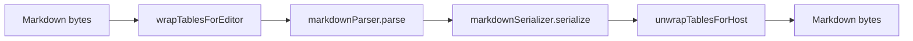

# Round-Trip Correctness Specification

## Purpose

Muninn's headline promise is that rich editing should not rewrite unrelated Markdown. This spec defines the testable contract for Markdown to ProseMirror to Markdown round trips.

## Pipeline Under Test

The expected result is byte-identical output for supported constructs. When byte identity is not currently possible, the deviation must be documented instead of hidden.

## Required Corpus

Create one or more fixture files for each category:

- ATX headings 1 through 6.
- Setext headings.
- Paragraphs with soft and hard breaks.
- Emphasis, strong, and code-span edge cases.
- Inline links, reference links, and autolinks.
- Images.
- Nested blockquotes.
- Fenced code blocks using backticks and tildes.
- Indented code blocks.
- Bullet lists using `-`, `*`, and `+`.
- Ordered lists with custom start numbers and both delimiter styles.
- GFM tables, including alignment colons, escaped pipes, and ragged rows.
- Task lists.
- Thematic breaks using `---`, `***`, and `___`.
- HTML blocks as pass-through content according to the current parser policy.
- YAML front matter.
- Trailing whitespace and no-final-newline cases.
- CRLF input.
- Unicode text.
- Mermaid fenced blocks.

## Known Deviations

If a fixture fails byte identity, record it in `tests/unit/round-trip/KNOWN_DEVIATIONS.md` with:

- Fixture name.
- Input excerpt.
- Output excerpt.
- Root cause.
- Whether the behavior is acceptable for alpha.

Known deviations are allowed only when they are explicit and visible in the generated report.

## Report

`npm run test:roundtrip` should produce `docs/ROUNDTRIP_REPORT.md` with:

- Total fixtures.
- Passing fixtures.
- Documented deviations.
- Unsupported categories.
- Short explanation of what the result does and does not prove.

The report is part engineering artifact, part public trust proof. Keep it factual.
